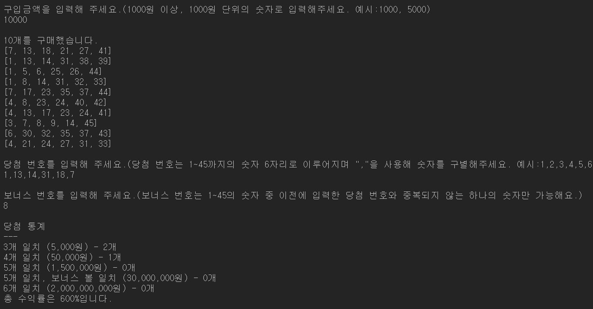

# 미션 - 로또

[우테코 6기 3주차 미션 저장소 바로가기](https://github.com/woowacourse-precourse/javascript-lotto-6)

## 소개

로또과제에 필요한 [기능](https://github.com/BadaHertz52/javascript-lotto-6/blob/badahertz52/docs/README.md)들을 세부적을 나누어 클래스를 생성하고, 이를 App에서 다시 로또의 진행과정인 "구입", "당첨 번호 뽑기", "당첨 여부 확인", "당첨 결과 출력"으로 묶어서 메서드를 만든 후, App의 play 메서드에서 실행하도록 해 과제를 구현했습니다.

### 실행 모습

<div>
  
</div>

### 파일 구조

<details>
<summary> 🗂️ 파일 구조 및 설명 보기</summary>
<div markdown="1">

```
📦src
 ┣ 📂constants
 ┃ ┣ 📜index.js
 ┃ ┣ 📜Message.js : 메세지와 관련된 변수 관리
 ┃ ┗ 📜Rule.js : 게임 룰에 대한 변수 관리
 ┣ 📂controllers
 ┃ ┣ 📜Cashier.js :구매 금액 입력값을 받아 이를 Payment에 전달해 유효성 검사를 실행 후 구매 금액에 따른 로또 발행
 ┃ ┣ 📜DrawingMachine.js: 당첨번호,보너스 번호에 대한 입력값을 받아 Lotto,BonusBall에 전달해 유효성 검사 후 이를 반환
 ┃ ┣ 📜index.js
 ┃ ┣ 📜InputController.js : 입력에 대한 컨트롤 담당 (입력값 받아 이를 다른 형태로 변환 후 이를 반환)
 ┃ ┗ 📜OutputController.js : 메세지 출력에 대한 컨트롤 (데이터를 받아서 출력 메세지에 맞게 변환 후 이를 출력하도록 함)
 ┣ 📂models
 ┃ ┣ 📜BonusBall.js : 보너스 번호를 받아서 이에 대한 유효성 검사 진행 후 유효한 보너스 번호 반환
 ┃ ┣ 📜Calculator.js : 당첨 결과에 따른 당첨금과 수익률 계산
 ┃ ┣ 📜Checker.js : 사용자 로또 번호와 당첨번호,보너스번호를 비교해 당첨 결과를 계산
 ┃ ┣ 📜CustomError.js : 새로운 Error타입을 생성
 ┃ ┣ 📜index.js
 ┃ ┗ 📜Payment.js : 구매 금액에 대한 유효성 검사 후 유효한 구매 금액을 반환
 ┣ 📂utils
 ┃ ┣ 📜index.js
 ┃ ┣ 📜Money.js  : 글자형태의 돈을 숫자로 변경하는 유틸 함수 관리
 ┃ ┣ 📜RandomNumbers.js : 랜덤 숫자에 관한 유틸 함수 관리
 ┃ ┣ 📜Sort.js : 배열의 졍렬에 대한 유틸 함수 관리
 ┃ ┗ 📜Validate.js : 유효성 검사에 자주 사용하는 유틸함수 관리
 ┣ 📂view
 ┃ ┣ 📜index.js
 ┃ ┣ 📜InputView.js : 사용자에게 입력값을 받음
 ┃ ┗ 📜OutputView.js :  메세지를 출력
 ┣ 📜App.js
 ┣ 📜index.js
 ┗ 📜Lotto.js : 로또 번호에 대한 유효성 검사 후 유효한 로또 번호를 반환
```

</div>
</details>

## 설치,실행,테스트

#### 설치

```bash
npm i
```

#### 실행

```bash
node ./src/index.js
```

#### 테스트

```bash
npm run test
```

## 공부

### throw 후 다시 진행하기

이번 과제 미션 중 사용자 입력값에 오류가 있을 경우, throw로 오류를 발생시킨 후에 관련 오류를 출력하고 오류가 일어난 부분을 다시 실행시키는 것이 있습니다.
이를 구현하기 위해 사용한 방법은 반복문과 try catch 조합입니다.

```js
const getValue = () => {
  let done = false;
  while (!done) {
    try {
      // 입력값 가져오기
      // 입력값에 대한 유효성 검사
      // 입력값 검사 실패시 throw Error
      done = true;
    } catch (e) {
      done = false;
      //오류 메세지 출력
    }
  }
};
```

try cath는 try문 안의 코드를 실행 시키다가 오류가 발생하면 catch 문이 실행되기때문에 이를 이용하면 오류가 발생하면 throw문으로 오류를 던지고 난후에 오류 메세지를 출력할 수 있고,
반복문을 통해 입력값에 오류가 없을 때 까지 입력값을 다시 받을 수 있습니다.

### 반복문과 재귀함수
프로그램의 특정 기능을 반복적으로 사용해야 할 때 반복문과 재귀함수를 사용할 수 있습니다.
재귀함수는 반복문에 비해 코드의 가독성이 높다고 평가되지만 재귀함수는 스택 메모리를 사용하기 때문에 오버플로우라는 큰 단점도 가지고 있습니다.
이러한 재귀함수의 단점을 피할 수 있는 방법은 반환값을 다시 반환하는 과정에서 추가적인 연산이 필요하지 않도록 구현하는 꼬리 재귀함수를 이용하는 것입니다.
그러나 꼬리 재귀함수가 대안이 될 수 있는 조건은 컴파일러가 꼬리 재귀의 최적화를 지원해야한다는 점입니다. 그래서 컴파일러가 없는 해당 과제에서는 반복문을 사용해 구현했습니다.

```js
//꼬리 재귀함수
function factorial(n, result) {
    if (n == 0) {
        return result;
    } else {
        return factorial(n - 1, n * result);
    }
}

```

### beforeEach를 활용해 반복되는 코드 줄이기

코드 리뷰를 통해서 클래스를 호출하는 반복적인 테스트 코드들을 "beforeEach"를 활용해 간결하게 작성하는 법을 알게 되었습니다.

```js
describe('App 테스트', () => {
  let app;
  beforeEach(() => {
    app = new App();
  });

  test('play 테스트', async () => {
    //...
    await app.play();
  });
});
```

### 비동기 테스트 코드

단위 테스트를 짜면서 배운 jest의 비동기 테스트 코드를 다음과 같습니다.

```js
test('비동기 테스트1', async () => {
  //....
  await expect(비동기()).reject.toThrow();
});

test('비동기 테스트2', async () => {
  //....
  const value = await getValue();
  expect(value).toBe('');
});

test('비동기 테스트3', () => {
  //....
  testArray.forEach(async () => {
    await expect(비동기()).resolves.toBe('');
  });
});
```

## Eslint 와 함수(매서드)길이

 Eslint 에서 "max-lines-per-function"를 이용해 함수의 최대 길이를 제한 할 수 있습니다.

```
"max-lines-per-function": ["error", { "max": 15 }]
```

## 도메인 로직이란?

도메인 로직에 대해 공부한 후 정리한 제가 생각하는 도메인 로직이란 "코드로 구현하고자 하는 핵심 기능을 이루는 단계/의사결정" 입니다. 
그외의 메세지를 출력,입력하는 것들은 애플리케이션 로직입니다.

제가 생각한 로또 과제에서의 도메인 로직은 다음과 같습니다.

- 사용자가 입력한 구매 금액을 로또를 구별할 수 있는 지 판단
- 사용자가 입력한 구매 금액에 따라 로또들을 생성
- 사용자가 입력한 당첨 로또 번호, 보너스 번호가 유효한 지 판단
- 사용자 로또들의 당첨 여부와 수익률을 계산

---

#### 참고 자료

[비즈니스 로직, 도메인 로직이 도대체 뭐지?](https://velog.io/@eddy_song/domain-logic)
