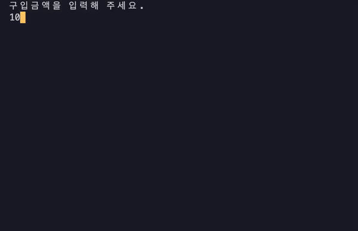
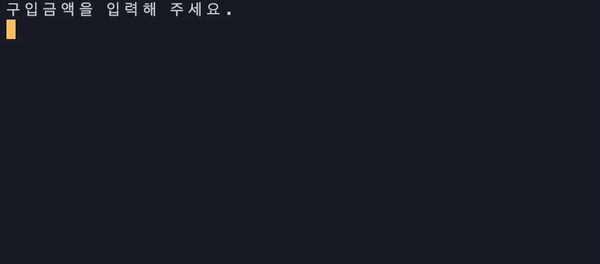
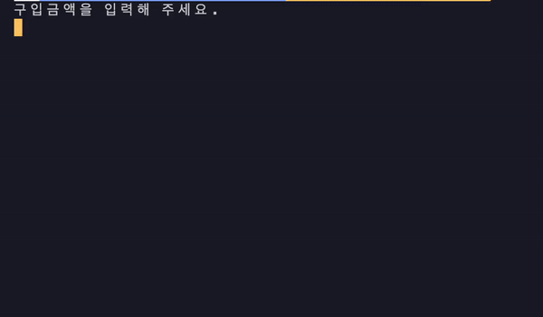
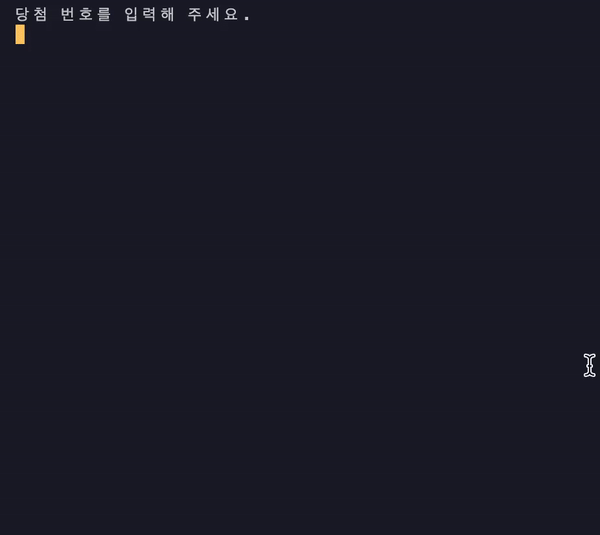
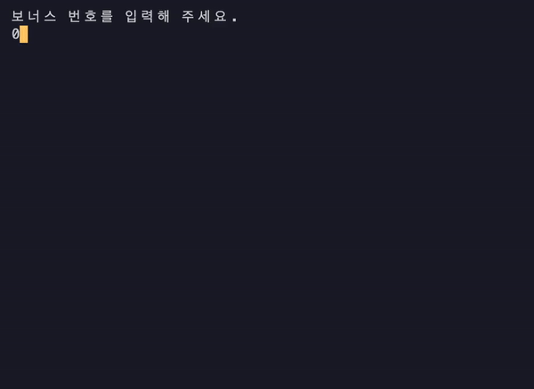
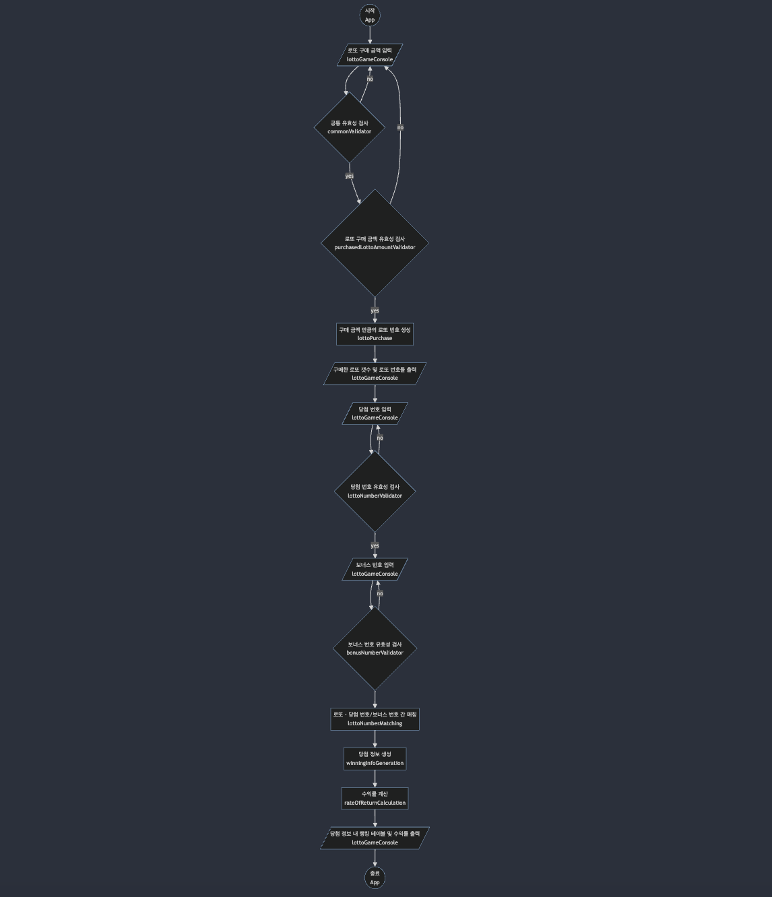

# 로또 게임 이란?

> 로또 구매 금액을 입력 하여 구매한 로또들을 확인한 다음 당첨 번호, 보너스 번호를 입력하여 당첨 금액 및 수익률을 확인하는 게임

# 동작 영상

<details>

<summary> 정상 동작 case </summary>



</details>

<br/>

<details>

<summary> 빈 값, 공백에 대한 예외 case </summary>



</details>

<br/>

<details>

<summary> 구매 로또 금액 예외 case </summary>



</details>

<br/>

<details>

<summary> 당첨 번호 예외 case </summary>



</details>

<br/>

<details>

<summary> 보너스 번호 예외 case </summary>



</details>

# 🚀 기능 목록

## 로또 구입 금액 입력 기능 (phase 1)

- `구입금액을 입력해 주세요.` 메시지를 출력한다.
- 유저로 부터 로또 구입 금액을 입력 받는다.
  - 로또 구매 금액은 숫자이다.
  - 로또 구매 금액은 1,000원 단위로 입력 받으며, 만약 나누어 떨어지지 않는다면 예외 처리 한다.
  - 로또 구입 금액은 최소 1,000원, 최대 10,000원 까지로 제한하며 범위를 벗어나는 가격은 예외 처리 한다.
  - 공백 및 띄어쓰기는 허용하지 않는다.

<details>

<summary> example </summary>

```plain text
구입금액을 입력해 주세요.
8000
```

</details>

## 로또 구매 기능 (phase 2)

- 구입 금액 만큼의 로또를 발행 한다.
  - 로또 1장의 가격은 1000원이다.
  - 발행 되는 로또 번호의 숫자 범위는 1 ~ 45의 정수이다.
  - 발행 되는 로또 번호의 갯수는 6개이다.
  - 발행 되는 로또 내 번호 들은 서로 중복되지 않는다.
  - 발행된 로또는 오름차순으로 정렬될 수 있어야 한다.

## 구매한 로또 출력 기능 (phase 3)

- `로또 구매한 갯수`를 구매했습니다. 메시지를 출력한다.
- 발행된 로또들을 [로또 번호] 형태로 출력한다.

<details>

<summary> example </summary>

```plain text
8개를 구매했습니다.
[8, 21, 23, 41, 42, 43]
[3, 5, 11, 16, 32, 38]
[7, 11, 16, 35, 36, 44]
[1, 8, 11, 31, 41, 42]
[13, 14, 16, 38, 42, 45]
[7, 11, 30, 40, 42, 43]
[2, 13, 22, 32, 38, 45]
[1, 3, 5, 14, 22, 45]
```

</details>

## 당첨 번호 입력 기능 (phase 4)

- `당첨 번호를 입력해 주세요.` 메시지를 출력한다.
- 로또 당첨 번호를 입력 받는다.
  - 숫자 범위, 당첨 번호의 갯수, 중복 여부는 로또 발행 기능과 동일하다.
  - 당첨 번호는 ,를 기준으로 구분한다.

<details>

<summary> example </summary>

```plain text
당첨 번호를 입력해 주세요.
1,2,3,4,5,6

```

</details>

## 보너스 번호 입력 기능 (phase 5)

- `보너스 번호를 입력해 주세요.` 메시지를 출력한다.
- 보너스 번호를 입력 받는다.
  - 보너스 번호의 숫자 범위는 1 ~ 45의 정수다.
  - 발행되는 보너스 번호의 갯수는 1개다.
  - 발행되는 보너스 번호는 당첨 번호와 중복되지 않는다.

<details>

<summary> example </summary>

```plain text
보너스 번호를 입력해 주세요.
7
```

</details>

## 로또 당첨 확인 기능 (phase 6)

- 유저가 구매한 로또 번호와 당첨 번호를 비교한다.
  - 일치 갯수, 보너스 번호 당첨 여부를 계산한다.
- 비교한 결과를 토대로 당첨 결과를 생성한다.
  - 당첨 결과는 로또 등수의 갯수, 당첨 금액이 포함된다.
  - 당첨 기준과 금액은 아래와 같다.
    - 1등: 6개 번호 일치 / 2,000,000,000원
    - 2등: 5개 번호 + 보너스 번호 일치 / 30,000,000원
    - 3등: 5개 번호 일치 / 1,500,000원
    - 4등: 4개 번호 일치 / 50,000원
    - 5등: 3개 번호 일치 / 5,000원
- 로또 구입 금액과 당첨 금액을 토대로 수익률을 계산한다.

## 게임 결과 출력 기능 (phase 7)

- 당첨 결과와 수익률을 통해 게임 결과를 출력한다.

<details>

<summary> example </summary>

```plain text
당첨 통계
---
3개 일치 (5,000원) - 1개
4개 일치 (50,000원) - 0개
5개 일치 (1,500,000원) - 0개
5개 일치, 보너스 볼 일치 (30,000,000원) - 0개
6개 일치 (2,000,000,000원) - 0개
총 수익률은 62.5%입니다.
```

</details>

## 예외 처리 (공통)

- 사용자가 잘못된 값을 입력할 경우 throw문을 사용해 예외를 발생시킨다.
- "[ERROR]"로 시작하는 에러 메시지를 출력하고 해당 부분부터 입력을 다시 받는다.

<details>

<summary> example </summary>

```plain text
[ERROR] 로또 번호는 1부터 45 사이의 숫자여야 합니다.
```

</details>

# 📈 Flow Chart



# 📁 Folder Structure

```plain text
project
│
├── __tests__
│   ├── ApplicationTest.js
│   └── LottoTest.js
│
├── docs
│   ├── MISSION_GOAL.md
│   ├── ARCHITECTURE.md
│   └── README.md
│
├── src
│   ├── cli (입/출력을 담당하는 모듈)
│   │   └── lottoGameConsole (로또 게임의 입/출력을 담당)
│   │   │   ├── LottoGameConsole.test.js
│   │   │   └── lottoGameConsole.module.js
│   │   └── systemConsole.module.js (전체적인 입/출력을 담당)
│   │
│   ├── constants
│   │   ├── lottoGame.js
│   │   └── symbols.js
│   │
│   ├── domain
│   │   ├── confirmWinningResult (우승 결과 확인 관련 모듈)
│   │   │   ├── lottoNumberMatching (로또 - 당첨 번호 매칭)
│   │   │   │     ├── LottoNumberMatching.test.js
│   │   │   │     └── lottoNumberMatching.module.js
│   │   │   ├── rateOfReturnCalculation (수익률 계산)
│   │   │   │     ├── RateOfReturnCalculation.test.js
│   │   │   │     └── rateOfReturnCalculation.module.js
│   │   │   ├── winningInfoGeneration (당첨 정보 생성)
│   │   │   │     ├── WinningInfoGeneration.test.js
│   │   │   │     └── winningInfoGeneration.module.js
│   │   │   └── index.js
│   │   └── lottoPurchase (로또 구매)
│   │   │   ├── lottoPurchase.module.js
│   │   │   └── lottoPurchase.test.js
│   │   ├── index.js
│   │   └── lotto.module.js (로또)
│   │
│   ├── error (에러 관련 책임을 담당)
│   │   ├── AppError (커스텀 에러)
│   │   │   ├── AppError.module.js
│   │   │   └── AppError.test.js
│   │   └── systemErrorHandler (예외 처리 관련 핸들러)
│   │       ├── SystemErrorHandler.test.js
│   │       └── systemErrorHandler.module.js
│   │
│   ├── interactions (애플리케이션의 흐름 제어를 담당)
│   │       └── lottoGame.module.js (로또 게임의 흐름 제어를 담당)
│   │
│   ├── utils (유틸 함수 관련 모듈)
│   │   ├── array (배열 관련 유틸 함수)
│   │   │   ├── Array.test.js
│   │   │   └── array.module.js
│   │   ├── object (객체 관련 유틸 함수)
│   │   │   ├── Object.test.js
│   │   │   └── object.module.js
│   │   └── jsDoc.js (jsDoc의 custom type 들을 모아놓은 모듈)
│   │
│   └── validations (유효성 검증을 담당하는 모듈)
│       ├── bonusNumberValidation (보너스 번호와 관련된 유효성을 담당하는 모듈)
│       │   ├── bonusNumberValidation.module.js
│       │   └── bonusNumberValidation.test.js
│       ├── commonValidation (공통적인 유효성을 담당하는 모듈)
│       │   ├── commonValidation.module.js
│       │   └── commonValidation.test.js
│       ├── lottoNumberValidation (로또 번호와 관련된 유효성을 담당하는 모듈)
│       │   ├── lottoNumberValidation.module.js
│       │   └── lottoNumberValidation.test.js
│       ├── purchasedLottoAmountValidation (로또 구매 금액과 관련된 유효성을 담당하는 모듈)
│       │   ├── purchasedLottoAmountValidation.module.js
│       │   └── purchasedLottoAmountValidation.test.js
│       └── utils
│       │    └── startValidation.js (validate 관련 함수 들을 추상화 시킨 모듈)
│       └── index.js
├── App.js
├── index.js
└── Lotto.js

```
