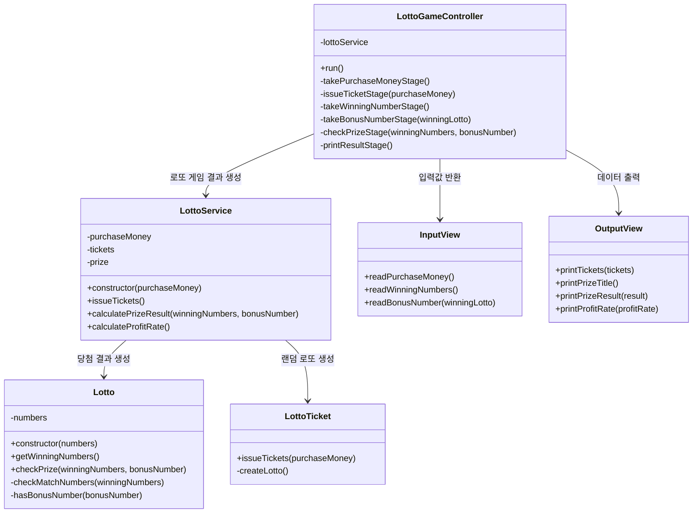
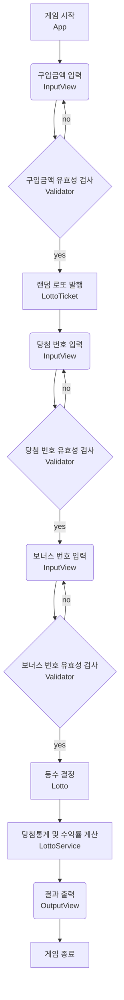

## 📂 파일 구조

```
src
 ┣ constants
 ┃ ┗ constants.js
 ┣ controller
 ┃ ┗ LottoGameController.js
 ┣ model
 ┃ ┗ LottoTicket.js
 ┣ service
 ┃ ┗ LottoService.js
 ┣ utils
 ┃ ┣ RandomGenerator.js
 ┃ ┗ Validator.js
 ┣ views
 ┃ ┣ InputView.js
 ┃ ┗ OutputView.js
 ┣ App.js
 ┣ Lotto.js
 ┗ index.js

```

<br>

## 🚀 구현 기능 목록

1. 구입금액을 입력받는 기능
   - (예외) 1,000원 단위가 아닌 경우
   - (예외) 1,000원 이하인 경우
   - (예외) 숫자가 아닌 경우
2. 구입금액에 맞게 로또 번호를 발행하는 기능
   - 1,000원 단위로 로또 1장씩 발행
   - 1~45 사이의 숫자, 중복 숫자 없음, 총 6개의 번호
3. 로또 번호를 출력하는 기능
   - 오름차순으로 정렬하여 출력
4. 당첨 번호를 입력하는 기능
   - 쉼표로 구분
   - (예외) 숫자가 아닌 경우
   - (예외) 번호가 6개가 아닌 경우
   - (예외) 1~45 사이의 숫자가 아닌 경우
   - (예외) 중복되는 숫자가 존재하는 경우
5. 보너스 번호를 입력하는 기능
   - (예외) 숫자가 아닌 경우
   - (예외) 1~45 사이의 숫자가 아닌 경우
   - (예외) 당첨 번호와 중복되는 숫자인 경우
6. 일치하는 번호 개수를 구하는 기능
7. 당첨통계를 구하고 출력하는 기능
   - 1등: 6개 번호 일치
   - 2등: 5개 번호, 보너스 번호 일치
   - 3등: 5개 번호 일치
   - 4등: 4개 번호 일치
   - 5등: 3개 번호 일치
8. 수익률을 구하고 출력하는 기능
   - 소숫점 둘째 자리에서 반올림

<br>

## 🔍 Description

### LOTTO 프로젝트 소개

구입금액을 입력하면 1,000원에 1장씩 로또가 발행됩니다. <br> 당첨 번호와 보너스 번호를 입력하면 발행된 로또와 일치하는 번호 개수를 구합니다. <br> 구입금액과 일치하는 번호 개수에 따른 상금 금액으로 수익률을 계산합니다. <br> <br>

## 🔗 Class Diagram



<br>

## 📈 Flow Chart


