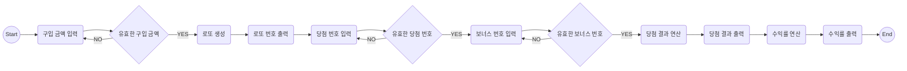

# 로또

로또 게임은 사용자가 원하는 만큼 로또를 구입하고, 구입한 로또들의 당첨 금액을 바탕으로 얼마만큼의 구입 금액 대비 얼마만큼의 수익을 얻었는지 계산하는 프로그램입니다.

## 주요 기능

- 입력

  - 예외 발생시 재 입력 기능
  - 로또 구입 금액 입력
    - 1000원 단위로 입력받고 나누어 떨어지지 않는 경우 예외 처리
  - 당첨 번호 입력

    - 중복되지 않는 6개의 숫자
    - 1~45 범위의 숫자
    - 쉼표를 기준으로 구분
    - 위 기준을 만족하지 않으면 예외처리

  - 보너스 번호 입력
    - 1~45의 숫자
    - 당첨 번호에 포함되지 않은 숫자
    - 위 기준을 만족하지 않으면 예외처리

- 로또 만들기

  - 입력한 구입 금액을 기준으로 로또 생성(6개의 중복 되지 않는 숫자)
  - 로또 번호 정렬
  - 로또 번호 반환

- 당첨 통계
  - 각 로또와 당첨 번호 / 보너스 번호 비교
  - 비교 결과 저장
  - 수익률 계산

## 코딩 컨벤션

### 함수

- 한 가지 기능만 담당하게 한다
  - 입력 기능, 유효성 검사 기능 분리
- 함수의 길이를 15라인을 넘기지 않는다.

### 들여쓰기

- 중첩 if문을 만들지 않는다.
- 반복문 안에는 최대 한개의 if문만을 사용한다.

### 테스트

- 테스트 코드를 먼저 작성한다.
- 테스트가 통과되지 않으면 커밋하지 않는다.

## 플로우 차트

### 실행 결과

