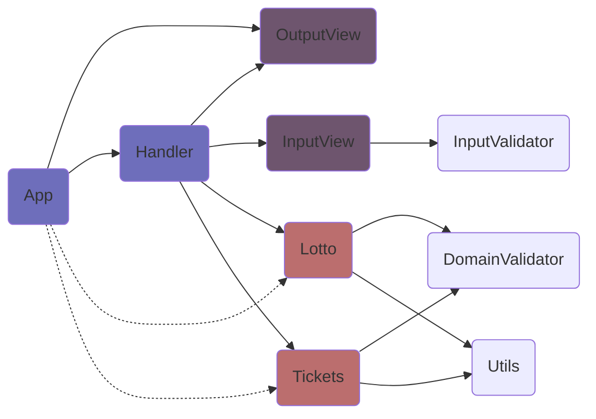

# 의존 관계 

- `Handler`가 `Lotto`와 `Tickets`의 인스턴스를 `App`에 반환
- 즉 `App`은 `Lotto`와 `Tickets`에 간접적으로 의존

 

# 기능 목록 및 중점 사항

## 🕹️ 앱 클래스

- [🕹️ 핸들러 모듈](#-핸들러), [👀출력 처리 모듈](#-출력-처리)에 의존, [🔑로또 클래스](#-로또), [🔑티켓 클래스](#-티켓)에 간접적 의존
- **티켓**의 인스턴스를 상태로 지님   
- 어플리케이션의 **흐름을 통제**하는 기능을 담당
- 최초 실행 이후 해당 인스턴스의 **티켓 구매 내역**과 **당첨 정보**를 출력하고자 하는 경우를 고려하여 메서드 구성
- 로또 인스턴스와 보너스 번호는 상태로 관리할 필요 없음

- [ ] 프로그램 실행 기능
    - [ ] 핸들러를 통해 **티켓**, **로또** 클래스의 인스턴스, **보너스** 번호를 받는 기능 [🕹️ 핸들러 모듈](#-핸들러)
    - [ ] 구입한 티켓 정보를 출력하는 기능
    - [ ] 로또 인스턴스를 통해 결과를 계산하는 기능 [🔑로또](#-로또)
    - [ ] 당첨 결과를 출력하는 기능
- [ ] 구입한 티켓을 **출력**하는 기능 [👀출력 처리 모듈](#-출력-처리)
- [ ] 당첨 결과를 **출력**하는 기능 [👀출력 처리 모듈](#-출력-처리)

## 🕹️ 핸들러

- [🔑로또 클래스](#-로또), [🔑티켓 클래스](#-티켓), [👀입력 처리 모듈](#-입력-처리), [👀출력 처리 모듈](#-출력-처리)에 의존
- 입력을 받아 검증하고 변환하거나 인스턴스를 생성하여 반환하는 기능을 담당
- 에러 발생 시에 재시도하는 로직을 위해 각 단위로 흐름을 분리

- [ ] 티켓
    - [ ] 티켓 구매 금액을 문자열로 **입력** 받아 **검증** 및 **변환** [👀입력 처리](#-입력-처리)
    - [ ] 금액을 변수로 **티켓** 클래스로 넘겨 **검증** 및 **인스턴스** 반환 [🔑티켓](#-티켓)
    - [ ] 검증 오류 발생 시 **#에러 핸들링** 메서드 실행
- [ ] 로또 게임 
    - [ ] 당첨 번호를 문자열로 **입력** 받아 **검증** 및 **변환** [👀입력 처리](#-입력-처리)
    - [ ] 당첨 번호를 변수로 **로또** 클래스로 넘겨 **검증** 및 **인스턴스** 반환 [🔑로또](#-로또)
    - [ ] 검증 오류 발생 시 **#에러 핸들링** 메서드 실행
- [ ] 보너스 번호 
    - [ ] 보너스 번호를 문자열로 **입력** 받아 **검증** 및 **변환** [👀입력 처리](#-입력-처리)
    - [ ] 보너스 번호를 **로또 인스턴스**에서 **검증** [🔑로또](#-로또)
    - [ ] 보너스 번호를 **숫자**로 반환
    - [ ] 검증 오류 발생 시 **#에러 핸들링** 메서드 실행
- [ ] #에러 핸들링
    - [ ] 검증 오류 발생 시 **오류 출력**  후 반복 [👀출력 처리](#-출력-처리)

## 🔑 로또

- [🔧검증 모듈](#-검증), [🔧유틸리티 모듈](#-유틸리티)에 의존   
- **당첨 번호**를 상태로 지님
- 로또 번호에 대한 **검증**과 **당첨 정보** 및 **수익률**의 계산을 담당

- [ ] **당첨 번호**의 유효성을 **검증**하는 기능 [🔧검증](#-검증)
- [ ] **보너스 번호**의 유효성을 **검증**하는 기능 [🔧검증](#-검증)
- [ ] **티켓들**을 받아 **당첨 정보**와 **수익률**을 **오브젝트**로 반환하는 기능 [🔧유틸리티](#-유틸리티)

## 🔑 티켓

- [🔧검증 모듈](#-검증), [🔧유틸리티 모듈](#-유틸리티)에 의존   
- **개별 티켓**과 **당첨 결과**를 상태로 지님
- 금액에 대한 **검증**과 해당하는 수량의 **티켓**을 랜덤으로 생성하여 반환하는 기능

- [ ] 주어진 **금액**에 상응하는 수량의 **티켓의 배열**을 생성하는 기능 [🔧유틸리티 모듈](#-유틸리티)
- [ ] 티켓 **구매 금액**을 **검증**하는 기능 [🔧검증](#-검증)
- [ ] `Random.pickUniqueNumbersInRange()`을 이용하여 **티켓**을 **생성** 후 **반환**하는 기능
- [ ] **당첨 결과**를 **등록** 및 **조회**하는 상태 관리 기능

## 👀 입력 처리

- [🔧검증 모듈](#-검증)에 의존
- 입력을 받아 **자료형**을 검증 후, 변환하여 **핸들러**에 넘겨주는 역할
- 검증은 최소한으로 진행

- [ ] 티켓 금액
    - [ ] 티켓 금액을 문자열로 **입력** 받아
    - [ ] 그 금액의 자료형을 **검증** 후 [🔧검증](#-검증)
    - [ ] 금액을 숫자로 **변환**하여 반환하는 기능
- [ ] 당첨 번호
    - [ ] 당첨 번호들을 문자열로 **입력** 받아
    - [ ] 그 번호들의 자료형을 **검증** 후 [🔧검증](#-검증)
    - [ ] 번호들을 숫자의 배열로 **변환**하여 반환하는 기능
- [ ] 보너스 번호
    - [ ] 보너스 번호를 문자열로 **입력** 받아
    - [ ] 그 번호의 자료형을 **검증** 후 [🔧검증](#-검증)
    - [ ] 번호를 숫자로 **변환**하여 반환하는 기능

## 👀 출력 처리

- 핸들러(에러)와 앱 클래스(티켓, 결과)로 부터 받은 인자를 형태에 맞게 출력하는 역할
- 여러 모델로부터 인자를 받는 경우의 복잡성을 고려해 **오브젝트** 형태로 인자를 받음

- [ ] 티켓
    - [ ] 티켓의 **구매 수량**과 구매한 **티켓 각각**의 번호를 괄호로 감싸 **출력**하는 기능
- [ ] 결과
    - [ ] 구매한 티켓의 **등수별 수량**과 **수익률**을 **출력**하는 기능
- [ ] 에러
    - [ ] **에러의 메시지**를 **출력**하는 기능

## 🔧 검증

- 도메인 검증과 입력 검증을 분리함(입력 단계와 도메인에 대한 지식을 분리)
- 검증 로직이 겹치는 부분이 존재하는 점과 리팩토링 시의 유지 보수성을 고려하여 모듈화

- [ ] 도메인 검증
    - [ ] 티켓 **구매 금액**을 **검증**하는 기능(금액의 범위, 금액의 단위)
    - [ ] **당첨 번호**를 **검증**하는 기능(당첨 번호의 수량, 당첨 번호들의 범위, 중복 여부)
    - [ ] **보너스 번호**를 **검증**하는 기능(보너스 번호의 범위, 중복 여부)
- [ ] 입력 검증
    - [ ] 티켓 구매 금액의 **자료형**(정수)을 **검증**하는 기능
    - [ ] 당첨 번호들의 **자료형**(정수의 배열)을 **검증**하는 기능
    - [ ] 보너스 번호의 **자료형**(정수)을 **검증**하는 기능

## 🔧 유틸리티

- 모델 로직 중, 상태를 직접 변화시키지 않고 계산하는 사항(당첨 내역, 수익률 등)을 위임

- [ ] 계산
    - [ ] 구입 **금액**을 **티켓 수량**으로 **변환**하는 기능
    - [ ] 티켓을 당첨 번호와 비교하여 **등수**를 **계산**하는 기능
    - [ ] 티켓의 당첨 정보를 통해 **수익률**을 **계산**하는 기능