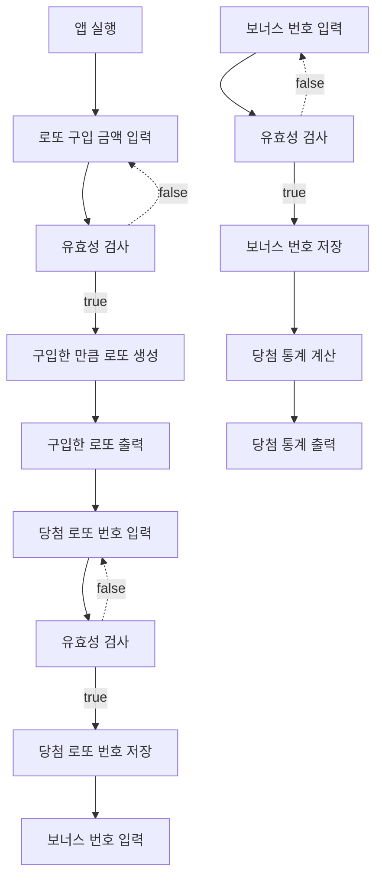
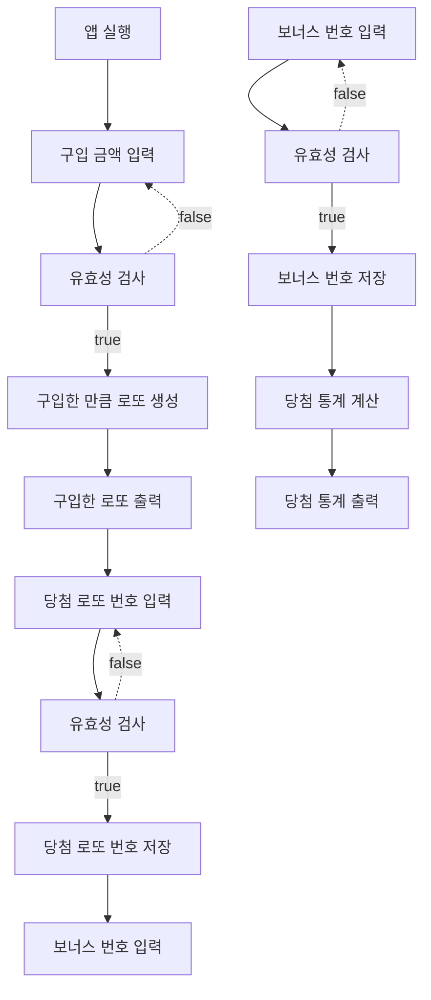

# 로또 by 강철원

## 2차 구현 목표

improve에 기록된 사항들을 준수하면서 구현한다.

## 기능 목록 (2차)

### 기능 개요

1. 로또 구입금액을 입력 받는다.
2. 유저에게 구입한 로또 개수 만큼 로또 번호들을 보여준다.
3. 당첨 번호를 입력 받는다.
4. 보너스 번호를 입력 받는다.
5. 당첨 통계를 보여준다.

### 기능 설계

- 1. 로또 구입금액을 입력 받는다.

  - [x] 로또 구입금액을 입력 받는다.
  - [x] [예외] 공백일 때 예외를 발생시킨다. (에러를 발생하고 에러 메시지를 출력한 뒤 해당 부분부터 다시 입력!)

- 2. 유저에게 구입한 로또 개수 만큼 로또 번호들을 보여준다.

  - [x] 로또 구입 금액을 유효성 체크 한다. (1,000원 단위)
    - [x] [예외] 숫자 외의 문자가 포함될 때
    - [x] [예외] 1000으로 나누어 떨어지지 않는 경우
    - [x] [예외] 최대 구매 금액 100,000원이 넘으면 예외를 발생시킨다. (스스로 결정)
  - [x] 로또 생성기를 구현한다.
  - [x] 구입한 금액 만큼 로또를 발행한다. (오름차순으로)
  - [x] 발행된 로또 데이터를 저장한다.
  - [x] 발행된 로또를 유저에게 보여준다.

- 3. 당첨 번호를 입력 받는다.

  - [x] 당첨 번호를 입력 받는다.
  - [x] [예외] 공백일 때 예외를 발생시킨다.
  - [x] string을 쉼표를 기준으로 split 한다. (구분자 변경 가능성 생각해서 구현)
  - [x] model에서 당첨 번호 유효성 체크를 한다.
    - [x] [예외] 숫자 외의 문자가 포함 될때
    - [x] [예외] 숫자가 6개가 아닐 때
    - [x] [예외] 정수가 아닐 때
    - [x] [예외] 중복되는 숫자가 존재할 때
    - [x] [예외] 1~45사이의 숫자가 아닐 때

- 4.  보너스 번호를 입력 받는다.

  - [x] 보너스 번호를 입력 받는다.
  - [x] [예외] 공백일 때 예외를 발생시킨다.
  - [x] model에서 보너스 번호 유효성 체크를 한다.
    - [x] [예외] 숫자 외의 문자가 포함될 때
    - [x] [예외] 정수가 아닐 때
    - [x] [예외] 1~45 사이의 숫자가 아닐 때
    - [x] [예외] 당첨 번호와 중복되는 숫자가 포함될 때

- 5. 당첨 통계를 보여준다.
  - [x] 1. 당첨 결과를 통걔로 정리한다.
  - [x] 2. 당첨 통계를 출력한다. (소수점 둘째 자리에서 반올림 100%도 100.0%으로 표기)

### 2차 플로우 차트

## 기능 목록 (1차)

### 기능 개요

- [] 1. 로또 구입금액을 입력 받는다.
- [] 2. 유저에게 구입한 로또 개수 만큼 로또 번호들을 보여준다.
- [] 3. 당첨 번호를 입력 받는다. (추첨)
- [] 4. 보너스 번호를 입력 받는다. (추첨)
- [] 5. 당첨 통계를 보여준다.

### 기능 설계

- [x] 1.  로또 구입금액을 입력 받는다.

  - [x] 구입 금액은 1,000원 단위로 입력 받는다.
    - [예외] 공백일 때
    - [예외] (수정)숫자 외의 문자가 포함될 때
    - [예외] 1000으로 나누어 떨어지지 않는 경우

- [x] 2. 유저에게 구입한 로또 개수 만큼 로또 번호들을 보여준다.

  - [x] 1. 로또 번호 생성기 구현
    - 로또 번호의 숫자 범위는 1~45까지이다.
    - 중복되지 않는 6개의 숫자
  - [x] 2. 유저가 로또를 구입한 개수만큼 로또 생성
  - [x] 3. 생성된 로또 데이터에 저장
  - [x] 4. 생성된 로또 유저에게 보여주기

- [x] 3. 당첨 번호를 입력 받는다. (추첨)

  - [x] 당첨 번호 추첨 시 중복되지 않는 숫자 6개를 뽑는다.
    - [예외] 공백일 때
    - [예외] (수정)숫자 외의 문자가 포함될 때
    - [예외] 정수가 아닐 때
    - [예외] 중복되는 숫자가 존재할 때
    - [예외] 1~45사이의 숫자가 아닐 때
  - [x] 당첨 번호 데이터에 저장

- [x] 4. 보너스 번호를 입력 받는다.

  - [예외] 공백일 때
  - [예외] (수정)숫자 외의 문자가 포함될 때
  - [예외] 정수가 아닐 때
  - [예외] 1~45사이의 숫자가 아닐 때
  - [예외] 당첨 번호와 중복되는 숫자가 포함될 때
  - [x] 보너스 번호 데이터에 저장

- [ ] 5. 당첨 통계를 보여준다.
  - [ ] 1. 당첨 통계 계산기를 구현한다.
  - [ ] 2. 당첨 통계를 계산한다.
  - [ ] 3. 당첨 통계를 보여준다.

### 1차 플로우 차트

### 1차 구현 회고

0. 일단 돌아가는 쓰레기를 만들었습니다.
1. 주로 신경썼던 부분은 기능 구현 위주, 작은 기능은 TDD, 규모가 크면 코드와 같이 테스트코드 작성, 공백 컨벤션 지키기, 당장 메서드 분리 가능한 것은 분리하기, indent 최대한 1로 유지, else 사용하지 않기, 함수 길이 15줄로 작성하기(outputView에서 한개 초과), 함수가 한 가지 일만 하도록 노력, getter/setter 줄이기 입니다.
2. Lotto 클래스를 사용해야해서 어떻게 사용할까 정말 고민을 많이 했습니다. 고민하다 결국 기존에 해오던 설계와 조금 다르게 하느라 시간이 훨씬 더 많이 걸렸던 것 같습니다.
3. 기능 구현이 우선이다보니 생각보다 기능 분리를 많이 하지 못했다. 2차 구현때는 제대로 해보자.
4. 아무리 기능 구현이 우선이라도 테스트 코드는 정말 중요한 것 같다. 규모가 작은 기능들은 TDD가 가능하고 그렇게 해야한다. 하지만 규모가 크다면 기능을 만들면서 동시에 테스트 코드도 만들어야한다. 이번에도 기능 구현이 우선이었지만 테스트 코드를 최대한 만들면서 병행했다 시간은 오래걸렸지만 치명적인 오류를 발견할 수 있어서 오히려 전체적인 시간은 줄어든 것 같다. 반드시 테스트코드는 넣어야한다.
5. 2차 구현때는 도메인 로직에 단위 테스트를 조금 더 신경써보자.
6. 현재 input으로 받는 값인 '구매 금액', '로또 당첨번호', '보너스 번호' 전부 클래스로 감싸고 있는데 이 방법이 상당히 괜찮은 것 같다. 최대한 getter/setter을 줄이고 메시지를 던지는 방식으로 구현해보려고 노력했다.
7. 유효성 체크를 모델에서 하도록 변경하였다. 그래서 `InputView`에서는 기본적인 체크인 공백으로 입력했는지만 확인한다. 유효성 체크는 토론 주제로 나올만큼 의견이 분분한데 아직은 나도 확실히 어디서 할지는 정하지는 않았지만 다양한 시도를 해보고 있는 중이다.
8. 메시지를 상수에 둘지 지금처럼 외부로 둘지 더 생각해볼 것
9. 현재 당첨 통계 구현이 정말 별로다 이 부분도 생각해볼 것
10. 컨트롤러에서는 최대한 기능 분리를 했는데 나쁘지 않은 것 같다. 최대한 최상층 추상화 단계에서는 함수만 보고도 이해가 되도록 구성해보았다.
11. 기능 목록이 단위가 큰것같다. 조금 쪼개보자.
