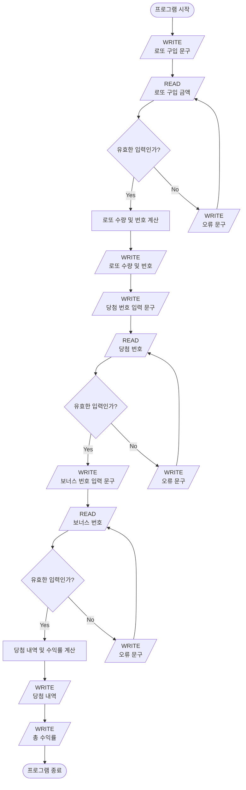

# ⚙️ '로또 게임' 기능 목록

### ✅ 진행 상황 확인

- 🔴 진행 전
- 🟡 진행 중
- 🟢 진행 완료
- 🔵 테스트 완료

### 🔗 Workflow

### 🔵 1. 로또 구입 금액 입력

- ✏️ 기능 설명

  사용자가 로또 구입 금액을 입력한다.

- 🚫 유의 사항

  - 로또 구입 금액을 입력하면 구입 금액에 해당하는 만큼 `로또`를 발행한다.
  - 로또 1장의 가격은 `1,000원`이다.
  - `1,000원` 단위로 입력 받으며, `1,000`으로 나누어 떨어지지 않는 경우 예외 처리한다.
  - 사용자의 값을 입력 받기 위해서는 `Console.readLineAsync`를 활용한다.
  - 출력을 위해서는 `Console.print`를 활용한다.
  - 사용자가 잘못된 값을 입력한 경우 `throw` 문으로 예외를 발생시키고, `[ERROR]`로 시작하는 에러 메시지를 출력한 후, 입력을 다시 받는다.

- 🔍 예시

  - 1️⃣ 문구 출력

          구입 금액을 입력해 주세요.

  - 2️⃣ 사용자 입력

          8000

  - 3️⃣ 유효성 검사

          [ERROR] 입력이 잘못된 형식입니다.

### 🔵 2-1. 로또 수량 및 번호 계산

- ✏️ 기능 설명

  사용자의 로또 구입 금액을 바탕으로 로또 수량과 번호를 계산한다.

- 🚫 유의 사항

  - 로또 1장의 가격은 `1,000원`이다.
  - 로또 번호의 숫자 범위는 `1 ~ 45`까지이다.
  - `1개`의 로또를 발행할 때 중복되지 않는 `6개`의 숫자를 뽑는다.
  - Random 값 추출은 `Random.pickUniqueNumbersInRange()`를 활용한다.

### 🔵 2-2. 로또 수량 및 번호 출력

- ✏️ 기능 설명

  로또 구입 금액을 바탕으로 발행한 로또 수량과 번호를 출력한다.

- 🚫 유의 사항

  - `로또 수량`을 출력한 후 `로또 번호`를 출력한다.
  - 로또 번호는 `오름차순`으로 정렬하여 보여준다.
  - 출력을 위해서는 `Console.print`를 활용한다.

- 🔍 예시

      3개를 구매했습니다.
      [8, 21, 23, 41, 42, 43]
      [3, 5, 11, 16, 32, 38]
      [7, 11, 16, 35, 36, 44]

### 🔵 3-1. 당첨 번호 입력

- ✏️ 기능 설명

  사용자가 당첨 번호를 입력한다.

- 🚫 유의 사항

  - 로또 번호는 `6개` 입력되어야 한다.
  - 로또 번호는 `쉼표(,)`를 기준으로 구분한다.
  - 로또 번호의 숫자 범위는 `1 ~ 45`까지이다.
  - 사용자의 값을 입력 받기 위해서는 `Console.readLineAsync`를 활용한다.
  - 출력을 위해서는 `Console.print`를 활용한다.
  - 사용자가 잘못된 값을 입력한 경우 `throw` 문으로 예외를 발생시키고, `[ERROR]`로 시작하는 에러 메시지를 출력한 후, 입력을 다시 받는다.

- 🔍 예시

  - 1️⃣ 문구 출력

        당첨 번호를 입력해 주세요.

  - 2️⃣ 사용자 입력

        1,2,3,4,5,6

  - 3️⃣ 유효성 검사

        [ERROR] 입력이 잘못된 형식입니다.

### 🔵 3-2. 보너스 번호 입력

- ✏️ 기능 설명

  사용자가 보너스 번호를 입력한다.

- 🚫 유의 사항

  - 보너스 번호는 `1개` 입력되어야 한다.
  - 사용자의 값을 입력 받기 위해서는 `Console.readLineAsync`를 활용한다.
  - 출력을 위해서는 `Console.print`를 활용한다.
  - 사용자가 잘못된 값을 입력한 경우 `throw` 문으로 예외를 발생시키고, `[ERROR]`로 시작하는 에러 메시지를 출력한 후, 입력을 다시 받는다.

- 🔍 예시

  - 1️⃣ 문구 출력

        보너스 번호를 입력해 주세요.

  - 2️⃣ 사용자 입력

        7

  - 3️⃣ 유효성 검사

        [ERROR] 입력이 잘못된 형식입니다.

### 🔵 4-1. 당첨 내역 및 수익율 계산

- ✏️ 기능 설명

  사용자가 구매한 로또 번호와 당첨 번호를 비교하여 당첨 내역과 수익율을 계산한다.

- 🚫 유의 사항

  - 당첨은 `1등`부터 `5등`까지 있다.
  - `6개` 번호가 일치하면 `1등`이고 `2,000,000,000원`의 수익을 얻는다.
  - `5개` 번호와 `보너스` 번호가 일치하면 `2등`이고 `30,000,000원`의 수익을 얻는다.
  - `5개` 번호가 일치하면 `3등`이고 `1,500,000원`의 수익을 얻는다.
  - `4개` 번호가 일치하면 `4등`이고 `50,000원`의 수익을 얻는다.
  - `3개` 번호가 일치하면 `5등`이고 `5,000원`의 수익을 얻는다.

### 🟢 4-2. 당첨 내역 출력

- ✏️ 기능 설명

  사용자의 당첨 내역을 출력한다.

- 🚫 유의 사항

  - 출력을 위해서는 `Console.print`를 활용한다.

- 🔍 예시

      3개 일치 (5,000원) - 1개
      4개 일치 (50,000원) - 0개
      5개 일치 (1,500,000원) - 0개
      5개 일치, 보너스 볼 일치 (30,000,000원) - 0개
      6개 일치 (2,000,000,000원) - 0개

### 🟢 4-3. 총 수익률 출력

- ✏️ 기능 설명

  사용자의 총 수익률을 출력한다.

- 🚫 유의 사항

  - 수익률은 `소수점 둘째 자리`에서 반올림한다.
  - 출력을 위해서는 `Console.print`를 활용한다.

- 🔍 예시

      총 수익률은 62.5%입니다.

 

# 📆 '자동차 경주' 구현 계획

<table>
<thead>
<th style="text-align: center">날짜</th>
<th style="text-align: center">구현 사항</th>
<th style="text-align: center">추정 시간</th>
<th style="text-align: center">상태</th>
<th style="text-align: center">실제 시간</th>
</thead>
<tr>
<td>11월 5일 (일)</td>
<td>기능 구현 목록 정리 및 기능 목록 1, 2, 3 구현</td>
<td>5 Hours</td>
<td style="text-align: center">🟢</td>
<td>5 Hours</td>
</tr>
<tr>
<td>11월 6일 (월)</td>
<td>기능 목록 4 구현 및 리팩토링</td>
<td>5 Hours</td>
<td style="text-align: center">🟢</td>
<td>5 Hours</td>
</tr>
<tr>
<td>11월 7일 (화)</td>
<td>코드 점검 및 리팩토링</td>
<td>3 Hours</td>
<td style="text-align: center">🟡</td>
<td>-</td>
</tr>
<tr>
<td>11월 8일 (수)</td>
<td>과제 제출</td>
<td>1 Hours</td>
<td style="text-align: center">🔴</td>
<td>-</td>
</tr>
</table>
