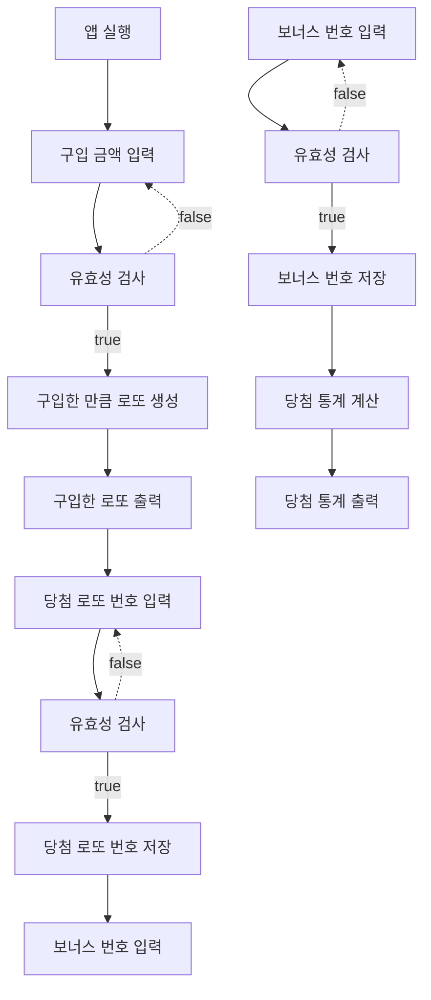

# 로또 by 강철원

## 기능 목록

### 기능 개요

- [] 1. 로또 구입금액을 입력 받는다.
- [] 2. 유저에게 구입한 로또 개수 만큼 로또 번호들을 보여준다.
- [] 3. 당첨 번호를 입력 받는다. (추첨)
- [] 4. 보너스 번호를 입력 받는다. (추첨)
- [] 5. 당첨 통계를 보여준다.

### 기능 설계

- [x] 1.  로또 구입금액을 입력 받는다.

  - [x] 구입 금액은 1,000원 단위로 입력 받는다.
    - [예외] 공백일 때
    - [예외] (수정)숫자 외의 문자가 포함될 때
    - [예외] 1000으로 나누어 떨어지지 않는 경우

- [ ] 2. 유저에게 구입한 로또 개수 만큼 로또 번호들을 보여준다.

  - [ ] 1. 로또 번호 생성기 구현
    - 로또 번호의 숫자 범위는 1~45까지이다.
    - 중복되지 않는 6개의 숫자
  - [ ] 2. 유저가 로또를 구입한 개수만큼 로또 생성
  - [ ] 3. 생성된 로또 데이터에 저장
  - [ ] 4. 생성된 로또 유저에게 보여주기

- [ ] 3. 당첨 번호를 입력 받는다. (추첨)

  - [ ] 당첨 번호 추첨 시 중복되지 않는 숫자 6개를 뽑는다.
    - [예외] 공백일 때
    - [예외] (수정)숫자 외의 문자가 포함될 때
    - [예외] 정수가 아닐 때
    - [예외] 중복되는 숫자가 존재할 때
    - [예외] 1~45사이의 숫자가 아닐 때
  - [ ] 당첨 번호 데이터에 저장

- [ ] 4. 보너스 번호를 입력 받는다.

  - [예외] 공백일 때
  - [예외] (수정)숫자 외의 문자가 포함될 때
  - [예외] 정수가 아닐 때
  - [예외] 1~45사이의 숫자가 아닐 때
  - [예외] 당첨 번호와 중복되는 숫자가 포함될 때
  - [ ] 보너스 번호 데이터에 저장

- [ ] 5. 당첨 통계를 보여준다.
  - [ ] 1. 당첨 통계 계산기를 구현한다.
  - [ ] 2. 당첨 통계를 계산한다.
  - [ ] 3. 당첨 통계를 보여준다.

### 1차 플로우 차트

