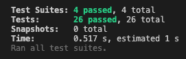

# :computer: [FE] JonghyunLEE12


## :dart: 미션 - 로또

### `로또 게임 기능 구현해야 한다.`

#### 규칙

##### 	1. 로또 번호의 숫자 범위는 `1 ~ 45` 까지이다.

##### 	2. 1개의 로또의 발행할 때 중복되지 않는 `6개의 숫자`를 뽑는다.

##### 	3. 당첨 번호는 추첨 시 `중복되지 않는 숫자 6개와 보너스 번호 1개`를뽑는다.

##### 	4. 당첨은 `1등 부터 5등` 까지 있다.


#### 입력 및 출력

##### 	1. 사용자가 로또 구입 금액을 입력하면 구입 금액에 해당하는 로또를 발행.

##### 		- 로또 1장의 가격은 1,000원

##### 	2. 당첨 번호와  보너스 번호를 입력받는다.

##### 	3. 사용자가 구매한 로또 번호와 당첨 번호를 비교하여 당첨 내역 및 수익률을 출력하고 로또 게임을 종료한다.


#### 예외

##### 	사용자가 잘못된 값을 입력한 경우 throw문을 사용해 예외를 발생 시킨다.


## :white_check_mark: 구현 로직 순서

- [x] ##### 사용자 로또 구입금액 입력 받기

  - [x] ##### 입력값(구입 금액)에 대한 유효성 검사 진행

  - [x] ##### 입력값에러 발생 시, 구입 금액 다시 입력받기

    

- [x] ##### 입력값에 맞는 로또 구입 갯수 출력

  - [x] ##### 사용자 로또 구입 테스트 케이스 작성

  

- [x] ##### 입력값에 맞는 로또 번호 출력

  

- [x] ##### 당첨 번호 입력 받기

  - [x] ##### 입력값(당첨 번호)에 대한 유효성 검사 진행

  - [x] ##### 입력값에러 발생 시, 당첨 번호 입력 다시받기.

- [x] ##### 보너스 번호 입력 받기

  - [x] ##### 입력값(보너스 번호)에 대한 유효성 검사 진행

  - [x] ##### 입력값에러 발생 시, 보너스 번호 입력 다시받기.


- [x] ##### 당첨 통계 출력

  - [x] ##### 당첨 통계 테스트 케이스 작성

  

- [x] ##### 총 수익률 출력

  - [x] ##### 수익률 출력 테스트 케이스 작성


# :heavy_check_mark: 커밋 컨벤션

```
feat (feature)
fix (bug fix)
docs (documentation)
style (formatting, missing semi colons, …)
refactor
test (when adding missing tests)
chore (maintain)
```


# :sos: 고민

#### :one:  주어진 Lotto 클래스를 어떻게 이용할 것인가?

현재 코드에선 InputValidate를 쓰기 때문에 Lotto Class의 validate를 사용안해도 된다.

하지만 미션에 주어진 Lotto클래스를 최대한 활용해서 해보고 싶다.

현재 문제는 사용자가 로또 당첨 금액을 입력하는 부분에서 발생

View에서 로또 클래스를 선언할 수 없음 => 의존성 원칙

그럼 Controller에서 선언해야 하는데 => 그럼 에러케이스가 상위까지 전달하지 못함(await 이슈)

#### :heavy_exclamation_mark: 해결

```js
static async createLottoInstance(numbers) {
    const inputValidate = new InputValidate();
    await inputValidate.lengthSix(numbers);
    return new Lotto(numbers);
  }
```

> 로또 클래스를 다음과 같이 선언해주자.

=> LottoClass의 생성자의 선언되어 있는 예외 함수를 내가 만든 예외 함수로 관리해주고 싶었다.

그러기 위해 우선 Lotto Class를 factory 함수를 이용하여 생성해주자!!

> Factory 함수는 복잡한 객체를 설정할 때 사용됨.


#### :two: 주어진 LottoTest를 활용하자

Test로 주어진 LottoTest를 활용하고 싶다!


#### :heavy_exclamation_mark:해결

```js
test("로또 번호의 개수가 6개가 넘어가면 예외가 발생한다.", () => {
    expect(() => {
      new Lotto([1, 2, 3, 4, 5, 6, 7]);
    }).toThrow("[ERROR]");
  });
```

기존 코드는 비동기 처리에 맞지 않기 때문에, 현재 코드에 작성된 로직에 맞게 다음과 같이 변경

```js
test('로또 번호의 개수가 6개가 넘어가면 예외가 발생한다.', async () => {
    const numbers = [1, 2, 3, 4, 5, 6, 7];
    await expect(Lotto.createLottoInstance(numbers)).rejects.toThrow('[ERROR]');
  });
```


#### :three: 결과를 어떻게 반환해줄 것인가?

당첨 통계 출력 부분 중 Lotto가 몇개 맞았는지 어떻게 반환해줄것인지에 대한 고민

1. Controller 클래스에 object 필드 선언 후 반환 해주는게 좋을까?
2. LottoUtils 안에서 객체를 생성 후 반환해줄까?

#### :heavy_exclamation_mark:해결

LottoUtill 클래스의 생성자에 당첨 객체를 선언해주고 결과를 return 해주자!

```js
class LottoUtill {
  #calcNumber;

  #staticObject;

  constructor(
    calcNumber,
    staticObject = {
      3: 0,
      4: 0,
      5: 0,
      6: 0,
      bonus: 0,
    },
  ) {
    this.#calcNumber = calcNumber;
    this.#staticObject = staticObject;
  }
}
```


#### :four: Lotto Controller Class안에 필드를 작성하는것이 맞는가?

 Lotto Controller 의 역할은 게임의 진행을 위한것, 여기서 Fields 를 작성해주는 것이 과연 맞을까?

차라리 사용되는 함수를 return 해주는 것이 맞지 않을까?


#### :heavy_exclamation_mark:해결

기존은 Lotto.js 파일을 models폴더에 넣어 사용했다.

하지만 요구사항 중 

`프로그래밍 요구 사항에서 달리 명시하지 않는 한 파일, 패키지 이름을 수정하거나 이동하지 않는다.`

는 요구사항을 확인하였고, model 폴더에 LottoData 파일을 생성해줬다.

LottoData 는 `DTO`의 개념에서 착안하여 데이터들을 담고 함수를 통해 업데이트 되는

방식으로 사용하였다!

```js
// LottoData.js
class LottoData {
  userMoney;

  userNumber;

  winNumber;

  bonusNumber;

  constructor(userMoney = 0, userNumber = [], winNumber = [], bonusNumber = 0) {
    this.userMoney = userMoney;
    this.userNumber = userNumber;
    this.winNumber = winNumber;
    this.bonusNumber = bonusNumber;
  }

  getUserMoney(userMoney) {
    this.userMoney = userMoney;
  }

  getWinNumber(winNumber) {
    this.winNumber = winNumber.sort((a, b) => a - b);
  }

  getBonusNumber(bonusNumber) {
    this.bonusNumber = bonusNumber;
  }
}

export default LottoData;

```

이로써, Controller 안에 필드를 없애고, 데이터를 더욱 MVC패턴 스럽게 

다룰 수 있게 되었다.

View에서 데이터 입력

Controller로 Model의 데이터 업데이트

Model 데이터를 담아두는 역할


#### :five: 나는 주어진 Lotto.js 파일을 잘 활용하고 있는가?

LottoController가 하고 있는 역할 및 Lotto번호에 관한 로직등을

Lotto.js가 관리하도록 하는게 더 좋을거 같다는 생각.


#### :heavy_exclamation_mark: 해결

구입한 로또 번호를 Lotto.js 파일 안에서 생성 되도록 했다.

```js
import { Random } from '@woowacourse/mission-utils';
import InputValidate from './utils/InputValidate.js';

class Lotto {
  #numbers;

  constructor(numbers) {
    this.#numbers = numbers;
  }

  static async createLottoInstance(numbers) {
    const inputValidate = new InputValidate();
    await inputValidate.lottoNumber(numbers);
    return new Lotto(numbers);
  }

  // TODO: 추가 기능 구현
  sortingNumber() {
    this.#numbers.sort((a, b) => a - b);
    return this.#numbers.join(', ');
  }

  async generator() {
    this.#numbers = await Random.pickUniqueNumbersInRange(1, 45, 6);
    return this.#numbers;
  }
}

export default Lotto;
```


### :heavy_exclamation_mark: Test Case 작성

추가 된 요구사항 중

 `도메인 로직에 단위 테스트를 구현해야 한다. 단, UI(Console.readLineAsync, Console.print) 로직에 대한 단위 테스트는 제외한다.`

에 대한 요구사항이 있었다. 해당 요구사항에 따라 테스트케이스를 수정하면서

expect().toBe() 와 expect().toStrictEqual() 의 차이를 알게 되었다.


expect().toBe() 는 `===`와 같은 사용한 값이 정확한지 비교를 한다.

결과가 문자열 또는 숫자일때 알맞은 사용인거 같다!

```js
 test('수익률 테스트', () => {
    const lottoUtill = new LottoUtill();

    const userMoney = 1000;
    const userNumber = [[1, 2, 3, 4, 5, 6]];
    const winNumber = [1, 2, 3, 19, 22, 23];
    const bonusNumber = 45;

    const staticObject = lottoUtill.checkLottoCorrect(
      userNumber,
      winNumber,
      bonusNumber,
    );
    // 실행 부
    const rateUtill = new LottoUtill(userMoney, staticObject);
    expect(rateUtill.getRate()).toBe(500);
  });
});
```


expect().toStrictEqual() 은 보다 엄격한 비교를 하게된다.
결과가 객체일 때, 비교값의 Key와 Value등이 똑같은지 엄격한 비교를 한다!.

```js
test('5등,보너스 당첨 테스트', () => {
    const lottoUtill = new LottoUtill();

    const userNumber = [
      [1, 2, 3, 4, 5, 7],
      [1, 2, 3, 4, 5, 10],
    ];
    const winNumber = [1, 2, 3, 4, 5, 6];
    const bonusNumber = 10;

    const staticObject = lottoUtill.checkLottoCorrect(
      userNumber,
      winNumber,
      bonusNumber,
    );

    const expected = { 3: 0, 4: 0, 5: 1, 6: 0, bonus: 1 };
    expect(staticObject).toStrictEqual(expected);
  });
```


## :rocket: 실행결과

