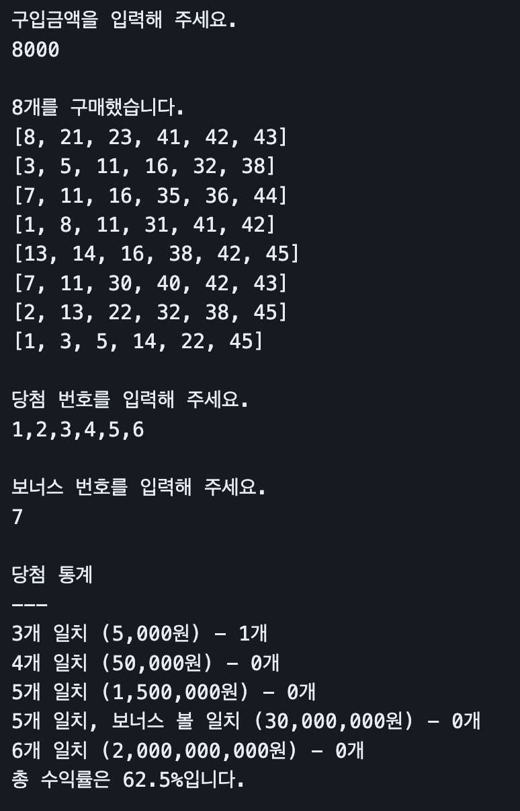
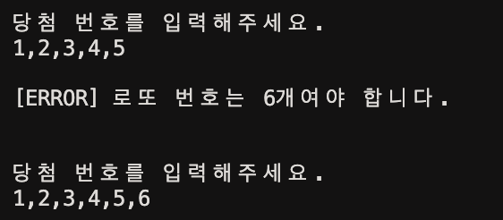
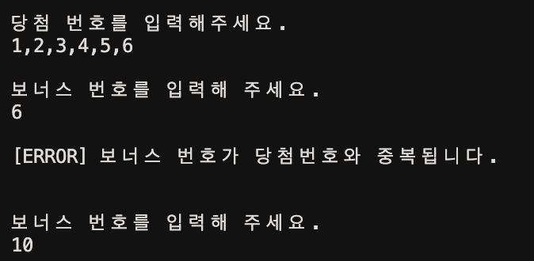
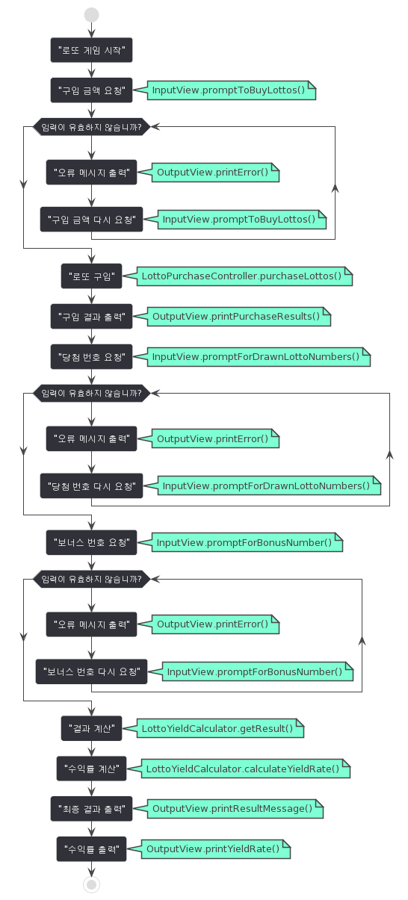
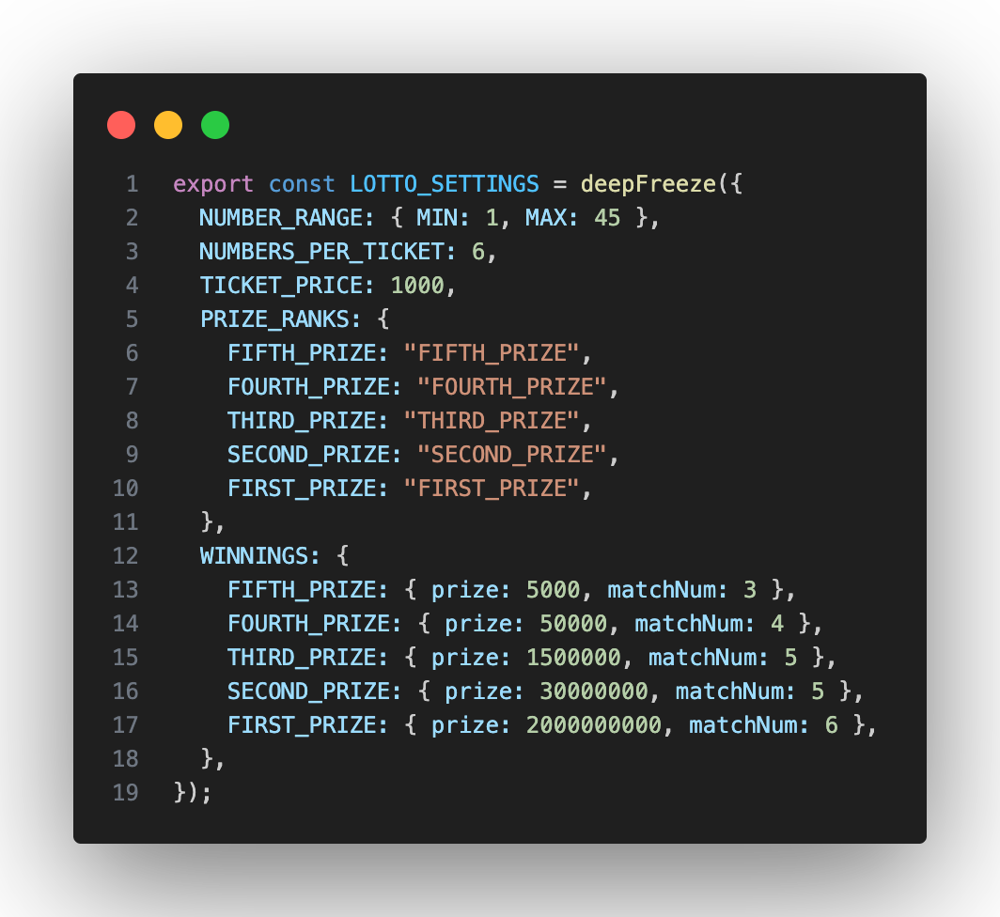
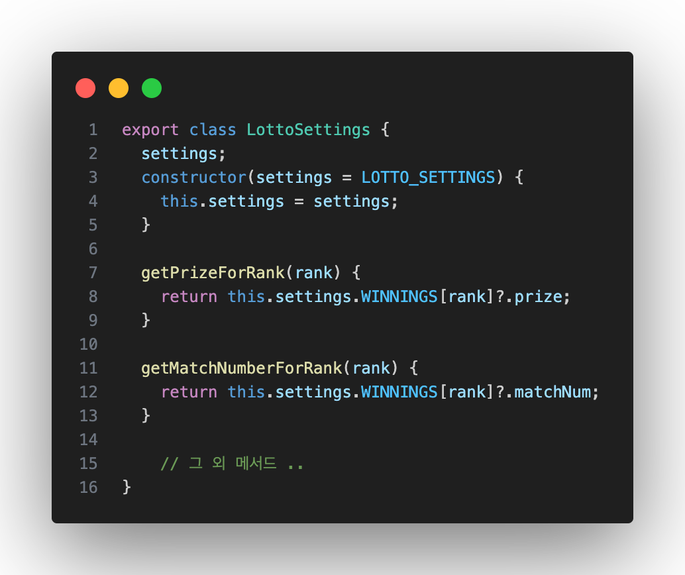

 

## 📒 목차

- [📒 목차](#-목차)
- [📌  로또 게임 설명](#로또-게임-설명)
- [✅  기능 구현 목록](#기능-구현-목록)
  - [1)  로또 구매하기](#1로또-구매하기)
  - [2)  당첨 번호 입력](#2당첨-번호-입력)
  - [3)  결과 발표](#3결과-발표)
- [🚨  로또 번호 재입력 요구 구현 사항](#로또-번호-재입력-요구-구현-사항)
- [🗄️  패키지 구조](#️패키지-구조)
- [🔢  전역 상수 관리하기 (매직 넘버 없애기)](#전역-상수-관리하기-매직-넘버-없애기)

 

## 📌&nbsp;&nbsp;로또 게임 설명

 <table>
<tr>
<th>출력 예시</th>
<th>게임 설명</th>
<tr>
<tr>
<td></td>
<td>로또 구입 후 당첨 통계를 확인하는 게임</td>
</tr>
 </table>

   
   

## ✅&nbsp;&nbsp;기능 구현 목록

### 1)&nbsp;&nbsp;로또 구매하기

- [x] 사용자에게 구입 금액을 입력받는다.

  - [x] 1000원 단위로 입력 받는다.
  - [x] 0, -1000 예외 처리한다.
  - [x] 1,000처럼 천단위 포맷팅 숫자도 입력 받을 수 있게한다.

- [x] 입력받은 금액으로 로또를 생성한다.
  - [x] 'n개를 구매하셨습니다.'라는 문구를 출력한다.
  - [x] 랜덤 로또 번호 생성은`Random.pickUniqueNumbersInRange` 을 이용한다.
- [x] 구매한 로또 번호를 출력한다.
  - [x] 생성된 로또번호는 리스트 형식으로 출력한다.

### 2)&nbsp;&nbsp;당첨 번호 입력

- [x] `Console.readLineSync`를 이용하여 "당첨 번호를 입력해주세요"라는 문구와 함께 입력받는다.
- [x] 사용자에게 당첨 번호를 입력받는다.
  - [x] 로또 숫자는 1~45 사이어야한다.
  - [x] 로또당 번호 갯수는 6개이고 중복되지 않아야한다.
  - [x] ,로 구분하여 입력받는다.
  - [x] 예외 처리 발생시 오류 메시지 출력 후, 재입력을 요구한다.
- [x] 보너스 번호를 입력받는다.
  - [x] 1개만 입력 받아야한다.
  - [x] 당첨 번호와 중복되지 않는지 검증한다.
  - [x] 예외 처리 발생시 오류 메시지 출력 후, 재입력을 요구한다.

### 3)&nbsp;&nbsp;결과 발표

- [x] 당첨 통계를 계산한다.
- [x] 당첨 결과를 출력한다.
- [x] 수익률을 계산한다.
  - [x] 소숫점 둘째자리에서 반올림한다.
- [x] 수익률을 출력한다.
  - [x] 천 단위로 , 포맷팅을 한다.
  - [x] 소숫점 첫째짜리까지 출력한다.

 
 

## 🚨&nbsp;&nbsp;로또 번호 재입력 요구 구현 사항

<table style="font-size:16px">
<tr>
  <th>당첨번호 번호 예외 발생 시</th>
  <th>보너스 번호 예외 발생 시 </th>
</tr>
<tr>
  <td>
  
  </td>
  <td>
  
  </td>
</tr>
<tr>
<td>로또 번호에 대한 예외 발생이 안될 때 까지 재입력을 요구하도록 구현</td>
<td>다시 <b>당첨 번호 입력으로 돌아가지 않고</b> 보너스 번호 재입력을 요구하도록 구현</td>
</tr>
</table>

  
 

## 🗄️&nbsp;&nbsp;패키지 구조

<table style="width:90%">
  <tr>
    <th >Package</th>
    <th align="center">Class</th>
    <th align="center">Description</th>
  </tr>
  <tr>
  <td><b>config</b></td>
  <td><b>LottoSettings</b></td>
  <td>로또 게임 설정을 관리</td>
  <tr>
  <tr>
    <td rowspan="4"><b>controller</b></td>
    <td><b>LottoGame</b></td>
    <td>게임의 메인 흐름을 제어</td>
  </tr>
  <tr>
    <td><b>LottoPurchaseController</b></td>
    <td>로또 구매를 담당</td>
  </tr>
  <tr>
    <td><b>DrawnLottoController</b></td>
    <td>추첨된 로또 생성을 담당</td>
  </tr>
  <tr>
    <td><b>AnnounceResult</b></td>
    <td>결과 발표를 담당</td>
  </tr>
  <tr>
    <td rowspan="3"><b>domain</b></td>
    <td><b>Lotto</b></td>
    <td>로또 번호를 관리</td>
  </tr>
  <tr>
    <td><b>PurchaseAmount</b></td>
    <td>구매 금액을 관리</td>
  </tr>
  <tr>
    <td><b>DrawnLotto</b></td>
    <td>추첨된 로또 번호를 관리</td>
  </tr>
<tr>
<td><b>service</b></td>
<td><b>LottoYieldCalculator</b></td>
<td>당첨 통계과 수익률을 계산</td>
</tr>
  <tr>
    <td rowspan="2"><b>view</b></td>
    <td><b>InputView</b></td>
    <td>사용자 입력을 처리</td>
  </tr>
  <tr>
    <td><b>OutputView</b></td>
    <td>출력을 담당</td>
  </tr>
<tr>
<td rowspan="3"><b>validator</b></td>
<td><b>LottoValidator</b></td>
<td>로또 번호를 검증</td>
</tr>
<tr>
<td><b>PurchaseAmountValidator</b></td>
<td>구입 금액을 검증</td>
</tr>
<tr>
<td><b>DrawnLottoValidator</b></td>
<td>당첨 번호와 보너스 번호를 검증</td>
</tr>

<!-- <tr>
<th colspan="3"  style="text-align: center;">class diagram</th>
</tr>

<tr>
<td colspan="3">

</td>
</tr> -->

<tr>
<th colspan="3" style="text-align: center;" >flow chart</th>
</tr>

<tr>
<td colspan="3">

</td>
</tr>

</table>

 
 

## 🔢&nbsp;&nbsp;전역 상수 관리하기 (매직 넘버 없애기)

> <b>LottoSettings</b> 클래스는 <b>LOTTO_SETTINGS</b>(로또 게임의 설정과 관련된 상수 오브젝트)를 캡슐화

<table style="width:90%">
  <tr>
    <th align="center">Package</th>
    <th align="center">Code</th>
    <th align="center">Description</th>
  </tr>
  <tr>
    <td><b>constants</b></td>
    <td></td>
     <td>deepFreeze 함수는 설정 객체의 깊은 불변성을 보장하여, 게임 실행 중 의도치 않은 변경을 방지</td> 
    
  </tr>
  <tr>
  
  </tr>

  <tr>
    <td rowspan="4"><b>Class</b></td>
    <td rowspan="4"></td> 
      <th>중앙 집중식 설정 관리 </th>
  </tr>
   <tr>
   <td>클래스를 통해 모든 설정을 관리하여 설정 값의 중복 사용을 방지하고 일관성을 유지</td>
  </tr>
  </tr>
  <tr>
  <th>유지보수 용이성 </th>
  </tr>
   <tr>
   <td> 설정 값이나 게임 규칙 변경 시 LottoSettings 클래스만 수정하면 된다</td>
  </tr>

</table>

 
 

<!-- ## 테스트

### setting의 바뀜에 따라 test -->
