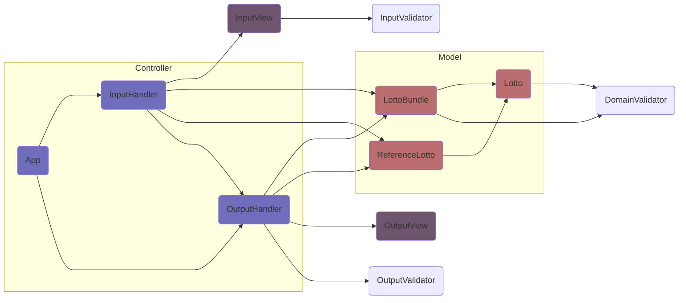

# 의존 관계

 

# 기능 목록 및 중점 사항

## 🕹️ 앱 클래스

- [🕹️ 입력 핸들러](#-입력-핸들러), [🕹️ 출력 핸들러](#-출력-핸들러)에 의존
- **로또 다발**의 인스턴스와 **레퍼런스 로또**의 인스턴스를 상태로 지님   
- 어플리케이션의 **흐름을 통제**하는 기능을 담당
- 최초 실행 이후 해당 인스턴스의 **로또 구매 내역**과 **당첨 정보**를 출력하고자 하는 경우를 고려하여 메서드 구성

- [X] 프로그램 실행 기능
    - [X] 핸들러를 통해 **로또 다발**, **레퍼런스 로또**, **보너스** 번호를 받는 기능 [🕹️ 입력 핸들러](#-입력-핸들러)
    - [X] 구입한 로또 정보를 출력하는 기능
    - [X] 당첨 결과를 출력하는 기능
- [X] 구입한 로또 정보를 **출력**하는 기능 [🕹️ 출력 핸들러](#-출력-핸들러)
- [X] 당첨 결과를 **출력**하는 기능 [🕹️ 출력 핸들러](#-출력-핸들러)

## 🕹️ 입력 핸들러

- [🕹️ 출력 핸들러](#-출력-핸들러), [🔑로또 다발 클래스](#-로또-다발), [🔑레퍼런스 로또 클래스](#-레퍼런스-로또), [👀입력 처리 모듈](#-입력-처리)에 의존
- 입력을 받아 검증, 변환, 인스턴스 생성, 상태 변화를 담당
- 에러 발생 시에 재시도하는 로직을 위해 각 단위로 흐름을 분리

- [X] 로또
    - [X] 로또 구매 금액을 문자열로 **입력** 받아 **검증** 및 **변환** [👀입력 처리](#-입력-처리)
    - [X] 금액을 변수로 **로또 다발** 클래스로 넘겨 **검증** 및 **인스턴스** 반환 [🔑로또 다발](#-로또-다발)
    - [X] 검증 오류 발생 시 **#에러 핸들링** 메서드 실행
- [X] 로또
    - [X] 당첨 번호를 문자열로 **입력** 받아 **검증** 및 **변환** [👀입력 처리](#-입력-처리)
    - [X] 당첨 번호를 변수로 **로또** 클래스로 넘겨 **검증** 및 **인스턴스** 반환 [🔑레퍼런스 로또(상속)](#-레퍼런스-로또)
    - [X] 검증 오류 발생 시 **#에러 핸들링** 메서드 실행
- [X] 보너스 번호 주입
    - [X] 보너스 번호를 문자열로 **입력** 받아 **검증** 및 **변환** [👀입력 처리](#-입력-처리)
    - [X] 보너스 번호를 **로또 인스턴스**에서 **검증** [🔑레퍼런스 로또(상속)](#-레퍼런스-로또)
    - [X] 레퍼런스 로또에 보너스 번호를 **설정** [🔑레퍼런스 로또](#-레퍼런스-로또)
    - [X] 검증 오류 발생 시 **#에러 핸들링** 메서드 실행
- [X] #에러 핸들링
    - [X] 검증 오류 발생 시 **오류 출력**  후 반복 [🕹️ 출력 핸들러](#-출력-핸들러)

## 🕹️ 출력 핸들러
- [🔑로또 다발 클래스](#-로또-다발), [🔑레퍼런스 로또 클래스](#-레퍼런스-로또), [👀출력 처리 모듈](#-출력-처리), [🔧검증 모듈](#-검증)에 의존
- 출력이 가능한 상태인지 **검증**하고(사용자가 게임 시작 전 출력 명령 등), 모델로부터 **데이터**를 받아 **가공**한 뒤, 출력 처리 모듈에 전달을 담당

- [X] 로또 다발
    - [X] 로또 다발을 출력할 수 있는 상태인지 **검증** [🔧검증](#-검증)
    - [X] 로또 다발의 데이터를 출력 처리 모듈에 **전달** [👀출력 처리](#-출력-처리)
- [X] 결과
    - [X] 결과를 계산할 수 있는 상태인지 **검증** [🔧검증](#-검증)
    - [X] 로또 다발과 레퍼런스 로또를 통해 **결과 계산** [🔑레퍼런스 로또](#-레퍼런스-로또)
    - [X] 결과 데이터를 출력 처리 모듈에 **전달** [👀출력 처리](#-출력-처리)
- [X] 에러
    - [X] 에러 메시지를 출력 모듈에 **전달** [👀출력 처리](#-출력-처리)
    - [X] 에러를 추가적으로 전달할지 결정

## 🔑 로또

- [🔧검증 모듈](#-검증)에 의존
- **당첨 번호**를 상태로 지님
- 로또 번호에 대한 **검증**과 **등수**의 계산을 담당

- [X] **당첨 번호**의 유효성을 **검증**하는 기능 [🔧검증](#-검증)
- [X] **보너스 번호**의 유효성을 **검증**하는 기능 [🔧검증](#-검증)
- [X] **레퍼런스 로또**를 받아 비교하여 **등수**를 반환하는 기능

## 🔑 로또 다발

- [🔑로또](#-로또), [🔧검증 모듈](#-검증)에 의존  
- **로또의 배열**과 **구매 내역**을 상태로 지님
- 금액에 대한 **검증**과 해당하는 수량의 **로또**를 랜덤으로 생성하는 기능

- [X] 로또 **구매 금액**을 **검증**하는 기능 [🔧검증](#-검증)
- [X] **금액**에 상응하는 수량의 **로또의 배열**을 생성하는 기능
- [X] `Random.pickUniqueNumbersInRange()`을 이용하여 **로또 1장**을 **생성** 후 **반환**하는 기능

## 🔑 레퍼런스 로또

- [🔑로또](#-로또)에 의존  
- `Lotto`를 상속 받는 클래스
- **보너스 번호**를 추가 필드로 지님
- **로또의 배열**에 속하는 각 로또들을 통해 등수를 계산하고, **결과**(당첨 내역, 수익률)를 반환하는 기능

- [X] **로또의 배열**을 받아 **당첨 정보**와 **수익률**을 **오브젝트**로 반환하는 기능

## 👀 입력 처리

- [🔧검증 모듈](#-검증)에 의존
- 입력을 받아 **자료형**을 검증 후, 변환하여 **입력 핸들러**에 넘겨주는 역할
- 검증은 최소한으로 진행

- [X] 로또 구매 금액
    - [X] 로또 구매 금액을 문자열로 **입력** 받아
    - [X] 그 금액의 자료형을 **검증** 후 [🔧검증](#-검증)
    - [X] 금액을 숫자로 **변환**하여 반환하는 기능
- [X] 당첨 번호
    - [X] 당첨 번호들을 문자열로 **입력** 받아
    - [X] 그 번호들의 자료형을 **검증** 후 [🔧검증](#-검증)
    - [X] 번호들을 숫자의 배열로 **변환**하여 반환하는 기능
- [X] 보너스 번호
    - [X] 보너스 번호를 문자열로 **입력** 받아
    - [X] 그 번호의 자료형을 **검증** 후 [🔧검증](#-검증)
    - [X] 번호를 숫자로 **변환**하여 반환하는 기능

## 👀 출력 처리

- 출력 핸들러로 부터 받은 인자를 가공하여 형태에 맞게 출력하는 역할
- 핸들러에서 여러 모델로부터 인자를 받는 경우의 복잡성을 고려해 **오브젝트** 형태로 인자를 받음

- [X] 로또 다발
    - [X] 로또의 **구매 수량**과 구매한 **로또 다발** 각각의 번호를 **출력**하는 기능
- [X] 결과
    - [X] 구매한 로또의 **등수별 수량**과 **수익률**을 **출력**하는 기능
- [X] 에러
    - [X] **에러의 메시지**를 **출력**하는 기능

## 🔧 검증

- 도메인 검증과 입력 검증을 분리함(입력 단계와 도메인에 대한 지식을 분리)
- 검증 로직이 겹치는 부분이 존재하는 점과 리팩토링 시의 유지 보수성을 고려하여 모듈화

- [X] 도메인 검증
    - [X] **구매 금액**을 **검증**하는 기능(금액의 범위, 금액의 단위)
    - [X] **당첨 번호**를 **검증**하는 기능(당첨 번호의 수량, 당첨 번호들의 범위, 중복 여부)
    - [X] **보너스 번호**를 **검증**하는 기능(보너스 번호의 범위, 중복 여부)
- [X] 입력 검증
    - [X] 구매 금액의 **자료형**(정수)을 **검증**하는 기능
    - [X] 당첨 번호들의 **자료형**(정수의 배열)을 **검증**하는 기능
    - [X] 보너스 번호의 **자료형**(정수)을 **검증**하는 기능
- [X] 출력 검증
    - [X] 로또 다발을 출력할 수 있는 상태인지 검증하는 기능
    - [X] 결과를 출력할 수 있는 상태인지 검증하는 기능