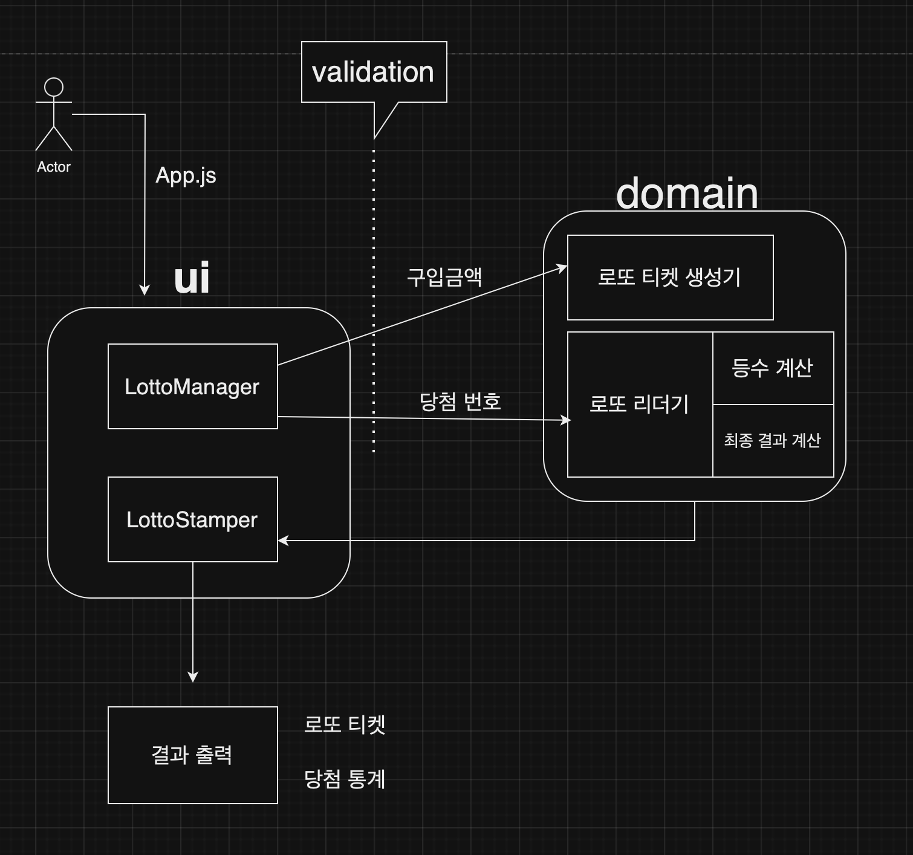

# Lotto Simulator

## 🔍 로또 소개
- 로또 기계는 1부터 45사이의 서로다른 숫자 6개를 랜덤하게 뽑아낸다.
- 로또 기계는 앞 6개와 중복되지 않는 1부터 45사이의 `보너스 번호`를 랜덤하게 뽑아낸다.
- 로또 기계가 만든 랜덤 숫자를 많이 맞출수록 더 많은 당첨금을 획들할 수 있다.
- 아무것도 당첨되지 않을 확률은 97.64%이다.
<br>
<br>

|등수|당첨 내용|당첨 확률|당첨금|          
|---|---|---|---|         
|1|6개 번호 모두 일치|0.0000122773804%|20억|
|2|5개 번호 일치 + 나머지 1개가 `보너스 번호`와 일치|0.000073664282399%|3천만원|
|3|5개 번호 일치|0.002799238607099%|150만원|
|4|4개 번호 일치|0.136425648021828|5만원|
|5|3개 번호 일치|2.222222222222222%|5천원|


<br>

## 🖥️ 프로그램 소개

- 로또를 임의로 발행하여 당첨 결과를 확인해볼 수 있는 시뮬레이터 입니다.  

- 희망하는 로또 구입 금액을 입력하면 금액에 해당하는 수량의 `로또 티켓`이 발행되며, 

- 이후 당첨 번호를 직접 입력하여 해당 티켓의 `딩첨 결과`와 `수익율`을 확인해볼 수 있습니다.     


<br>

## ⌨️  프로그램 실행
터미널창에 다음 명령어를 입력해 프로그램을 시작합니다.     

```bash
node src/index
```
<br>

## 🕹️  사용 방법
- 로또 하나의 금액은 `1000원` 입니다.
- 희망하는 금액을 `1000원` 단위로 입력해주세요.     
~~~bash
구입금액을 입력해 주세요.
8000
~~~

<br>

- 구입금액을 입력하면 금액에 해당하는 `로또수량`과 함께 `로또티켓`이 발행됩니다.
~~~bash
8개를 구매했습니다.
[1, 11, 12, 20, 23, 41]
[1, 4, 5, 10, 26, 29]
[6, 10, 16, 17, 23, 35]
[11, 14, 22, 23, 38, 44]
[1, 10, 30, 34, 40, 45]
[5, 19, 23, 32, 39, 43]
[1, 2, 8, 27, 29, 45]
[7, 10, 16, 17, 37, 38]
~~~

<br>

- 로또 추첨을 위해 `1부터 45` 사이의 당첨 번호를 `쉼표`로 구분하여 입력해주세요.
~~~bash
당첨 번호를 입력해 주세요.
7,10,16,41,42,43
~~~

<br>

- 1부터 45 사의의 보너스 번호를 입력해주세요.      
- 단, 보너스 번호는 `앞에서 입력한 6개의 당첨번호와 중복이 돼선 안됩니다.`     
~~~bash
보너스 번호를 입력해 주세요.
45
~~~

<br>

- 발행한 로또 티켓의 `당첨 결과`와 `총 수익률`을 보여주며 프로그램이 종료됩니다.     
~~~bash
당첨 통계
---
3개 일치 (5,000원) - 1개
4개 일치 (50,000원) - 0개
5개 일치 (1,500,000원) - 0개
5개 일치, 보너스 볼 일치 (30,000,000원) - 0개
6개 일치 (2,000,000,000원) - 0개
총 수익률은 62.5%입니다.
~~~

<br>

## 🚨 입력 주의 사항

### 1. 구매금액 오류

- 숫자 이외에 공백을 포함하여 기타 모든 문자 입력을 허용하지 않습니다.
~~~bash
3000w

[ERROR] 올바른 형식이 아닙니다.
~~~
<br>

- 구입금액 한도는 최대 10만원 입니다.
~~~bash
120000

[ERROR] 로또는 1인당 최대 10만원 까지 구매 가능합니다.
~~~
<br>

- 최소 하나 이상의 로또를 구매해야 합니다.
~~~bash
500

[ERROR] 금액이 부족합니다. 로또 한개의 금액은 1000원 입니다.
~~~
<br>

- 1000원 단위의 금액을 입력해야 합니다.
```bash
2900

[ERROR] 로또 구매 단위는 1000원 입니다.
```
<br>
<br>

### 2. 당첨 번호 오류
- 숫자와 쉼표(,)를 제외하고 공백을 포함한 모든 문자 입력을 허용하지 않습니다.    
```bash
1,2,3 ,4,5,f

[ERROR] 올바른 형식이 아닙니다.
```
<br>

- 당첨 번호는 반드시 6개의 숫자로 이루워져야 합니다.
```bash
1,2,3,4,5

[ERROR] 로또 번호는 6개여야 합니다.
```
<br>

- 당첨 번호는 중복을 불허합니다.
```bash
1,2,3,4,5,5

[ERROR] 중복된 당첨 번호가 있습니다.
```
<br>

- 당첨 번호는 1부터 45사이의 숫자여야 합니다.
```bash
1,2,3,4,5,46

[ERROR] 로또 번호는 1 부터 45 사이의 숫자입니다.
```
<br>

<br>

### 3. 보너스 번호 오류
- 보너스 번호는 숫자 이외에 공백을 포함하여 모든 문자를 허용하지 않습니다.
```bash
, a.!

[ERROR] 올바른 형식이 아닙니다.
```

- 보너스 번호는 1부터 45사이의 숫자여야 합니다.
```bash
0

[ERROR] 로또 번호는 1 부터 45 사이의 숫자입니다.
```
<br>

- 보너스 번호는 앞 6개의 당첨 번호와 중복을 불허합니다.
```bash
1,2,3,4,5,6 (당첨 번호)
6 (보너스 번호)

[ERROR] 7번째 보너스 번호는 6개의 당첨 번호와 중복이 돼선 안됩니다.
```
<br>

## 📂 파일 관계도    

src                                     
 ┣ constants              
 ┃ ┣ BusinessNumber.js  `로또 게임 관련 수치 상수화`                
 ┃ ┗ Messeage.js  `상수화된 게임 메세지 모음`        
 ┣ domain                 
 ┃ ┣ Bonus.js  `보너스 번호 유효성 검증`       
 ┃ ┣ LotteryMachine.js  `구입금액 유효성 검증,로또 티켓 생성 및 발급`               
 ┃ ┣ LottoRankMaker.js  `로또 당첨 등수 채점기`                    
 ┃ ┣ LottoReader.js  `로또 티켓, 당첨번호 데이터를 핵심 로직에 분배`                              
 ┃ ┗ LottoStatistics.js  `당첨 통계 계산`                  
 ┣ error                             
 ┃ ┗ CustomError.js  `에러 메세지 PREFIX [ERROR] 생성`   
 ┣ ui                                       
 ┃ ┣ LottoManager.js  `사용자 입력 및 로또 시뮬레이션 컨트롤`                                                                 
 ┃ ┗ LottoStamper.js  `로또 출력 결과 활자판`                   
 ┣ util                                
 ┃ ┗ EarningRate.js  `증가율 공식`                 
 ┣ App.js  `프로그램 시작점`                
 ┣ Lotto.js  `로또 번호 유효성 검증`                  
 ┗ index.js                              
       

<br>

## ⛓️ 로직 관계도


