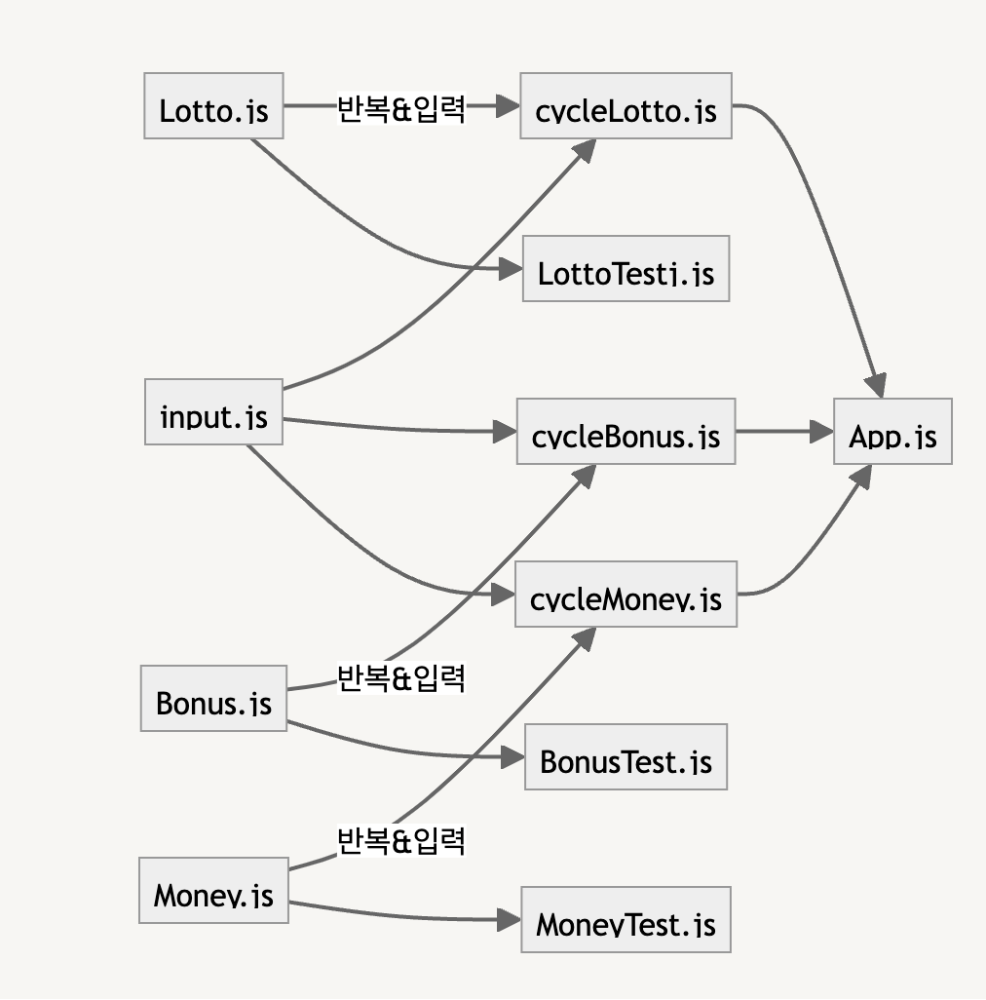

## 필요기능

1. 로또 숫자 생성 함수(범위 1~45) (makelottonum.js)
   1. 범위 : 1~ 45
   2. 중복되지 않는 6개 숫자
   3. 3-c의 결과값 받아서 필요한 개수만큼 출력(배열, 오름차순정렬)
2. 당첨 번호 입력받는 함수 (input.js)
   1. 범위 : 1~45
   2. 중복되지 않는 6개 숫자 + 1보너스 숫자(중복x, 따로 입력받음)
3. 로또 구입
   1. 로또 구입 금액 입력받기(천원단위)
   2. 로또 구입 금액 유효성 확인 → 천원단위 아니면 예외처리
   3. 구입 금액에 맞는 로또 개수 계산
4. 로또 당첨금 계산 함수

   ```
   - 1등: 6개 번호 일치 / 2,000,000,000원
   - 2등: 5개 번호 + 보너스 번호 일치 / 30,000,000원
   - 3등: 5개 번호 일치 / 1,500,000원
   - 4등: 4개 번호 일치 / 50,000원
   - 5등: 3개 번호 일치 / 5,000원
   ```

   5칸 배열 만들어서 각 등수마다 몇번 당쳠되었는지 저장  
   수입금 계산  
   위 두개는 객체로.

5. 수익률 계산 함수
   1. 당첨금/투자금\*100% (소수점 둘째자리에서 반올림),
6. 전체 출력 함수

## 오류 컨트롤

- 잘못된 값을 입력한 경우 예외를 발생시킴
- 에러 메시지를 출력하고 해당 부분부터 다시 입력 받음  
  -> try catch로 구현하기

## 모듈화

- App.js에 실행에 필요한 모든 파일을 import한다.
- 각 기능별로 함수를 나누고 비숫한 역할을 수행하는 함수들을 하나의 오브젝트에 담는다.
- Lotto 클래스의 필드와 생성자를 건드리지 않고, 기능을 수행하면서 LottoTest를 통과할 수 있게 한다.
  이를 위해 아래와 같은 방식으로 구현함.
  
- 보너스 숫자 입력과 구매 금액 입력 오브젝트들의 유효성 검사도 LottoTest와 비슷하게 동작할 수 있도록 구현함.
