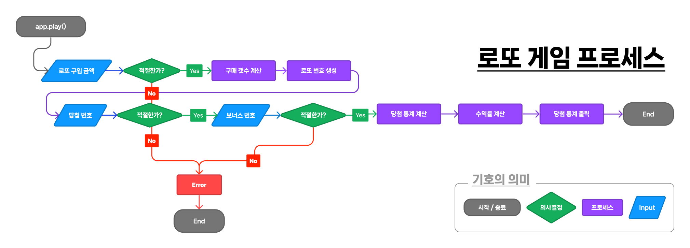
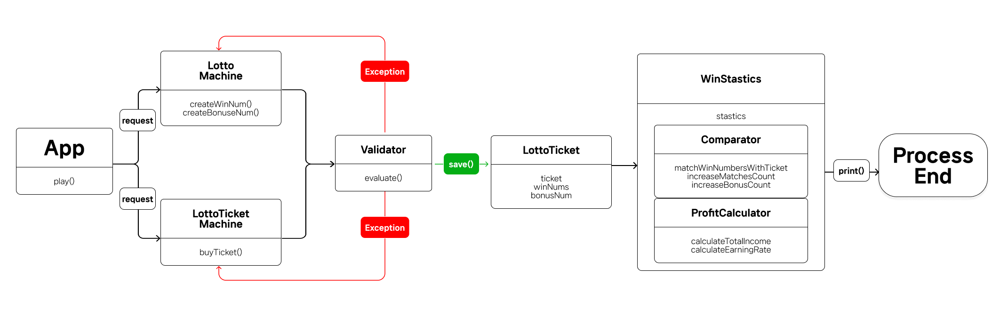

# 로또 게임 기능 리스트

로또 게임을 실행하는데 있어 필요한 도메인 로직과 비즈니스 로직을 중심으로 작성한다.

---

## 값 입력 시 사용되는 UI 기능 리스트

### 테스트 코드를 작성하지는 않지만 해당 기능들을 수행할 수 있어야 한다.

1. 도메인 로직 : 로또 구입 금액을 입력 받는다.

```
비즈니스 로직
- 구입 금액은 1,000 단위로 입력 받는다.
- 1,000 단위로 나누어 떨어지지 않을 경우 예외 처리한다.
```

2. 도메인 로직 : 당첨 번호를 입력 받는다.

```
비즈니스 로직
- 당첨 번호는 쉼표를 기준으로 구분되어야 한다.
- 당첨 번호는 반드시 쉼표를 제외하고 6글자여야 한다.
```

3. 도메인 로직 : 보너스 번호를 입력 받는다.

```
비즈니스 로직
- 보너스 번호는 반드시 숫자 하나만 입력 받아야 한다.
- 보너스 번호는 당첨 번호와 중복 되어서는 안된다.
```

2,3번 케이스에 공통적으로 필요한 조건

```
비즈니스 로직
- 반드시 숫자는 1~45 범위에 포함외는 숫자를 입력해야 한다.
- 중복되는 숫자가 입력되어서는 안된다.
```

모든 입력 값에 공통적으로 필요한 조건

```
비즈니스 로직
- 입력 값이 숫자 이외의 값인 경우 예외가 발생 해야 한다.
- 입력 값이 공백인 경우 예외가 발생 해야 한다.
```

---

## 로또 번호를 생성하는 기능 리스트

1. 도메인 로직 : 로또 번호를 생성한다.

```
비즈니스 로직
- 각각의 번호는 1~45 사이의 랜덤한 6개의 정수를 받는다.
- 6개의 숫자로 구성된 로또 번호를 생성한다.
- 각각의 번호는 중복되어서는 안된다.
- 각각의 번호가 숫자가 아닐 경우 예외가 발생해야 한다.

ex)
[1,2,3,4,5,6]
[1,2,3,4,5,5] -> 예외가 발생해야 한다.
```

---

## 로또 번호로 구성되어 있는 티켓을 생성하는 기능 리스트

1. 도메인 로직 : 티켓을 생성한다.

```
비즈니스 로직
- 티켓은 로또 클래스내의 모든 유효성 테스트를 통과해야 한다.
- 구매 가능한 가격 만큼의 로또 줄을 가진 티켓을 생성한다.
ex) 8개의 로또를 구매가 가능할 경우 8줄의 로또 번호를 갖고 있어야 한다. 
- 각각의 티켓은 고유한 Lotto 클래스를 각 줄에 갖고 있어야 한다.

ex)
const ticket = [
  new Lotto([1,2,3,4,5]),
  new Lotto([6,7,8,9,10]),
];
```

---

## 로또 게임 통계를 계산하는 기능 리스트

1. 도메인 로직 : 몇 개의 숫자가 일치하는지 계산한다.

```
비즈니스 로직
- 당첨번호와 티켓 번호의 순서와 숫자가 정확하게 일치해야 일치한다고 할 수 있다.
- 일치하는 숫자가 3개 미만인 경우는 다루지 않는다.
- 일치하는 경우의 수는 3개, 4개, 5개, 5개 볼이 일치하고 보너스 볼까지 일치할 경우, 6개가 있다.
- 각각의 일치하는 경우가 몇개가 나왔는지에 대한 정보를 저장한다.

ex)
3개 일치 : 1개
4개 일치 : 0개
5개 일치 : 1개
5개 일치, 보너스볼 일치 : 0개
6개 일치 : 0개
```

2. 도메인 로직 : 수익률을 계산한다.

```
비즈니스 로직

- 정해진 금액에 대한 총 당첨금을 계산한다.
  3개 일치 : 5,000원
  개 일치 : 50,000원
  5개 일치 : 1,500,000원
  개 일치, 보너스 볼 일치 : 30,000,000원
  개 일치 : 2,000,000,000원

- 수익률은 당첨 금액 / 구입 금액 * 100 으로 계산한다.
- 수익률은 소수점 둘째 자리에서 반올림하여 계산한다.
```

---

## 사용자에게 결과를 제공하는 UI 기능 리스트

### 테스트 코드를 작성하지는 않지만 해당 기능들을 수행할 수 있어야 한다.

1. 도메인 로직 : 사용자에게 구매한 로또 갯수를 제공한다.

```
비즈니스 로직
- 사용자가 입력한 금액으로 몇개의 로또를 구매할 수 있는지 출력 되어야 한다.
- ex) 8개를 구매했습니다.
```

2. 도메인 로직 : 사용자에게 구매한 로또의 번호를 제공한다.

```
비즈니스 로직
- 구매한 로또의 6자리 번호들이 입력한 금액으로 살 수 있는 총 로또의 갯수 만큼 출력되어야 한다.

ex) 4개의 로또를 구매 가능한 경우
[1,2,3,4,5,6]
[1,2,3,4,5,7]
[1,2,3,4,5,8]
[1,2,3,4,5,9]
```

3. 도메인 로직 : 사용자에게 당첨 통계를 제공해야 한다.

```
비즈니스 로직
- 당첨 통계는 아래의 형식 이후에 출력 되어야 한다.

ex)
당첨 통계
---
```

4. 도메인 로직 : 사용자에게 로또 당첨 결과를 제공해야 한다.

```
비즈니스 로직
- 몇 개의 숫자가 일치 되었는지 출력 되어야 한다.
- 일치하는 숫자들 중 중복이 있다면 중복된 갯수 만큼 출력 되어야 한다.

ex)
3개 일치 (5,000원) - 1개
4개 일치 (50,000원) - 8개
```

5. 도메인 로직 : 사용자에게 당첨 금액 대비 수익률을 제공해야 한다.

```
비즈니스 로직
- 복권을 산 금액과 당첨 금액간의 관계를 따져 수익률을 출력해야 한다.
- 출력되는 수익률은 반드시 소수점 둘째 자리에서 반올림하여 출력되어야 한다.

ex)
총 수익률은 62.5%입니다.
```


## 로또게임 프로세스



## 프로세스에 따른 클래스 리스트

