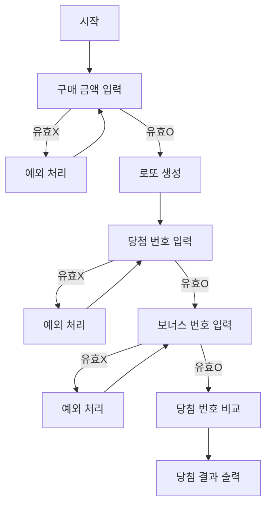

# 📚 WOOWAPRECOURCE ASSIGNMENT

# 💸 로또 게임

## 📜 기능 요구사항

### 구입 금액을 입력받는 기능

- 구입 금액은 숫자만 가능하다.
- 입력된 값이 소수, 음의 정수 등 유효하지 않은 숫자라면 예외처리한다.
- 구입 금액이 천원 단위로 나누어 떨어지지 않는다면 예외처리한다.

### 구입 금액만큼 로또를 발행하는 기능

- 구입 금액 / 1000 만큼의 로또를 발행한다.
- 로또 번호는 1부터 45까지의 번호들 중 중복되지 않도록 6개를 뽑아야 한다.
- 생성된 로또 번호는 오름차순으로 정렬되어야한다.

### 발행한 로또를 출력하는 기능

- 로또 번호는 string 형태로 출력되어야한다.

### 당첨 번호를 입력받는 기능

- 당첨 번호는 중복되지 않는 1부터 45의 숫자들 중 6개를 중복되지 않게 쉼표 단위로 입력해야한다.
- 쉼표 단위로 입력되지 않았거나, 숫자가 중복되었거나, 입력된 값이 1부터 45 사이가 아니라면 예외처리한다.
- 보너스 번호는 1부터 45의 숫자들 중 하나를 입력해야한다.
- 보너스 번호는 당첨 번호와 중복되거나, 1부터 45의 숫자가 아니거나, 정수가 아니라면 예외처리한다.

### 당첨 여부를 확인하는 기능

- 생성된 로또와 당첨 번호를 비교하여 당첨 결과를 계산한다.
- 당첨 결과는 번호가 3개 이상 일치할 때 부터 집계한다.

### 당첨 결과를 출력하는 기능

- 5등상(3개 일치) 부터 1등상(6개 일치)까지의 당첨 결과를 출력해야한다.
- 총 수익률 (당첨금 / 구매 금액 \* 100)을 소수점 두번째자리에서 반올림한다.

### 예외 처리

- 사용자가 잘못된 값을 입력할 경우 throw문을 사용해 예외를 발생시키고, "[ERROR]"로 시작하는 에러 메시지를 출력 후 해당 부분부터 재시작한다.

## 🌊 플로우차트



## 🗂️ 폴더 구조

```
📦src
 ┣ 📂constants
 ┃ ┣ 📜LottoMessage.js
 ┃ ┣ 📜LottoOption.js
 ┃ ┗ 📜Symbol.js
 ┣ 📂controller
 ┃ ┗ 📜LottoController.js
 ┣ 📂docs
 ┃ ┗ 📜README.md
 ┣ 📂error
 ┃ ┣ 📜DefaultError.js
 ┃ ┗ 📜ValidationError.js
 ┣ 📂model
 ┃ ┣ 📜BonusLotto.js
 ┃ ┣ 📜LottoGame.js
 ┃ ┣ 📜LottoResultCalculator.js
 ┃ ┗ 📜PlayerLotto.js
 ┣ 📂service
 ┃ ┗ 📜LottoService.js
 ┣ 📂utils
 ┃ ┗ 📜generateRandomNumber.js
 ┣ 📂validator
 ┃ ┣ 📜CommonValidator.js
 ┃ ┣ 📜index.js
 ┃ ┣ 📜LottoBonusNumberValidator.js
 ┃ ┣ 📜LottoNumbersValidator.js
 ┃ ┗ 📜LottoSeedMoneyValidator.js
 ┣ 📂view
 ┃ ┣ 📜InputView.js
 ┃ ┗ 📜OutputView.js
 ┣ 📜App.js
 ┣ 📜index.js
 ┗ 📜Lotto.js
```
